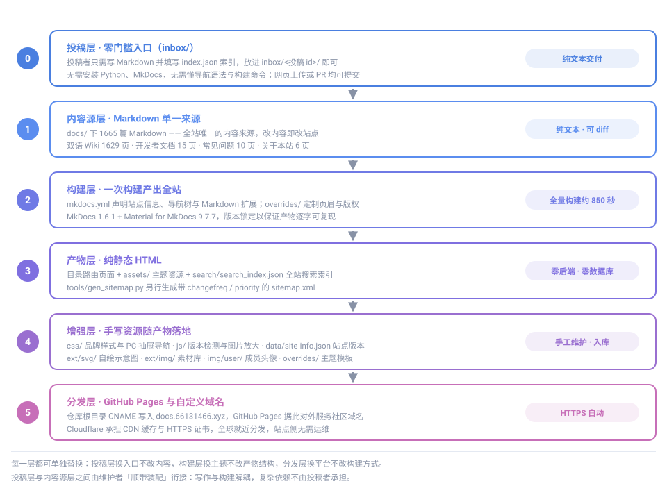
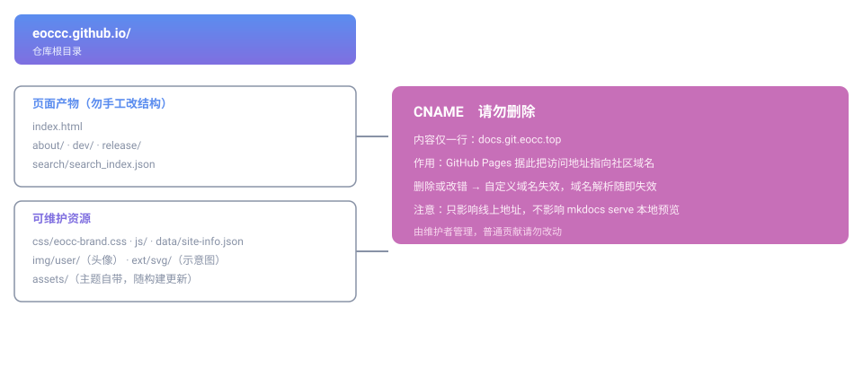

# eoccc.github.io

**Everyone Create Community（每个人创作社区，EOCC共创社区）** 的官方文档站。

站点托管于 **GitHub Pages**，通过自定义域名 **[docs.66131466.xyz](https://docs.66131466.xyz)** 对外服务，同时作为社区**公共知识库与协作文档中心**：社区文档、项目维基、教程分享与版本更新记录，全部集中在这里。

<p align="center">
  
</p>

---

## 目录

- [架构优势](#架构优势)
- [总体思路](#总体思路)
- [仓库结构与各目录规范](#仓库结构与各目录规范)
- [内容板块](#内容板块)
- [零门槛投稿](#零门槛投稿)
- [工具链与自动化](#工具链与自动化)
- [参与共建](#参与共建)
- [约定与注意事项](#约定与注意事项)
- [版权归属](#版权归属)

---

## 架构优势

本站刻意选择了「**Markdown 单一来源 → 静态构建 → 纯静态分发**」这条最朴素、也最耐用的技术路线。它带来的好处不是某一项功能的先进，而是整体结构上的一连串确定性：

| 优势 | 具体体现 |
|---|---|
| **零后端、零数据库** | 产物全是静态 HTML / CSS / JS，没有服务器进程、没有运行时可挂掉的依赖。站点的可用性只取决于托管平台，不取决于任何运维动作 |
| **内容与表现彻底分离** | `docs/` 里只有 Markdown，页面结构、导航、主题全部由 `mkdocs.yml` 声明。换主题、改导航、调样式都不需要碰正文一个字 |
| **产物可复现** | 构建版本被锁死在 MkDocs `1.6.1` + Material `9.7.7`，同一份源文件在任何机器上产出的 HTML 逐字一致，不会出现「本地好看、线上变形」 |
| **一切改动可追溯、可回滚** | 站点同时入库构建源与产物，每一次内容变更都有 commit、都能 diff、都能 revert。文档站因此天然具备版本管理能力 |
| **贡献门槛极低** | 贡献者只需要会写 Markdown 和提 Pull Request。不会 Git 也能直接在 GitHub 网页端编辑提交，环境搭建不是必需前置 |
| **构建与分发解耦** | 构建在本地产出 `site/`，再以文件同步的方式落地到仓库。构建失败不会污染线上，分发平台也可以整体替换 |
| **写作与构建解耦** | 投稿者只交付 Markdown + `index.json`，放进 `inbox/` 即可，无需任何本地环境；装配与构建由维护者顺带完成 |
| **检索能力开箱即有** | 基于 MkDocs 内置的 lunr 索引实现全站搜索，纯前端运行，无需 Elasticsearch 之类的搜索服务 |
| **成本近乎为零** | GitHub Pages 承担托管，Cloudflare 承担 CDN 与 HTTPS 证书，站点侧没有任何需要付费或续期的组件 |

> **一句话概括**：把复杂度一次性花在「写清楚」上，而不是持续花在「运维好」上。

## 总体思路

### 1. 单一来源，单向流动

内容只在 `docs/` 的 Markdown 里写一次，之后**只允许单向流动**：Markdown → 构建 → HTML 产物 → 分发。仓库里不允许出现「直接手改产物 HTML 补内容」这种逆向操作，否则源与产物立刻分叉，下一次构建就会把手工改动冲掉。

### 2. 构建源与产物同仓

本仓库比较特殊：它**同时存放 MkDocs 的构建源与最终产物**（`mkdocs.yml`、`docs/`、`overrides/` 与根目录的 `index.html`、`assets/` 等并存）。这样做的好处是任何人 clone 下来就能直接读源、直接预览、直接构建，不必再去另一个仓库找源文件；代价是提交时需要留意两者的同步关系。

### 3. 分层清晰，每层可独立替换

如上方架构图所示，站点分为**投稿层、内容源层、构建层、产物层、增强层、分发层**六层：

- 换投稿入口 → 只动投稿层，内容源与构建不动
- 换主题 → 只动构建层与增强层，内容源不动
- 换文档平台 → 只动构建层，产物结构基本不变
- 换托管平台 → 只动分发层，构建方式不变

每一层都留了替换余地，这是这套架构最重要的长期价值。

### 4. 写作与构建解耦

这是本站架构上最关键的一条取舍。MkDocs 构建一次全站约 **850 秒**，且必须严格锁定 `mkdocs==1.6.1` + `mkdocs-material==9.7.7`，否则产物的页眉、`meta generator` 与导航结构都会变形。

**这套约束是维护者必须承担的，却没有任何理由转嫁给作者。** 因此本站把「写内容」与「构建上线」彻底拆开：

- 投稿者只交付**纯文本**——一份 Markdown 加一份 `index.json` 索引，放进 [`inbox/`](inbox/README.md) 即可
- 不需要安装 Python、不需要跑 MkDocs、不需要学 `nav` 语法、不需要懂构建版本锁定
- 由维护者在**下一次构建时顺带装配**，一次构建服务多份投稿

投稿者交付的 md 与 json 都可 diff、可评审、可回滚，不含任何运行时依赖；装配动作由 [`tools/apply_inbox.py`](tools/apply_inbox.py) 自动化完成校验与落点，把维护者的手工成本压到最低。

> **一句话**：复杂构件与装配依赖，交给有环境、有经验的人；创作者只负责把内容写好。

### 5. 约定优于配置

命名、目录归属、图片存放位置、提交信息格式，全部有成文约定（见 [开发者文档](docs/dev/index.md)）。约定统一之后，协作者不需要每次重新讨论「这个文件该放哪」，评审也只需要看内容本身。

### 5. 面向社区共建而非个人站点

本站从设计之初就假定「会有很多人来改」：模板化 Issue 与 PR、明确的改动自查清单、双语 Wiki 镜像、术语统一规范，都是为了让多人协作时的沟通成本尽可能低。

## 仓库结构与各目录规范

<p align="center">
  
</p>

### 构建源

| 路径 | 作用 | 维护规范 |
|---|---|---|
| `inbox/` | **投稿区**：无需本地环境的投稿入口，每份投稿为一个文件夹，内含 `index.json` 索引与 Markdown | 投稿者只提交纯文本；由维护者顺带装配到 `docs/`；约定见 [`inbox/README.md`](inbox/README.md) |
| `mkdocs.yml` | 站点配置：站点信息、导航树（`nav`）、主题特性、Markdown 扩展、自定义 CSS / JS 接线 | **新增页面必须在此登记导航**，否则页面存在但进不去；构建版本锁定 `mkdocs==1.6.1` + `mkdocs-material==9.7.7` |
| `docs/` | **全部内容源**，1665 篇 Markdown | 只在 `docs/` 里写内容；`docs/` 内与站点路由同构，`docs/dev/start.md` 对应线上 `/dev/start/` |
| `docs/wiki/mindustry/{zh,en}/` | 双语 Wiki 源（中文 811 页、英文镜像 810 页） | 中英两侧结构对齐；改动一侧时同步另一侧 |
| `docs/wiki/mindustry/CHANGELOG.md` | Wiki 内容变更记录 | 跟随 Wiki 内容改动更新 |
| `overrides/partials/` | 主题模板覆盖（`nav.html` 页眉导航、`copyright.html` 页脚版权） | 改动前需了解 Material 主题模板结构，避免升级时冲突 |
| `docs/ext/`、`docs/css/`、`docs/js/`、`docs/img/` | 供构建引用的资源副本（与根目录同名目录保持一致） | 构建源内的资源副本需与根目录实际发布的资源同步 |

> `mkdocs.yml` 中的 `exclude_docs` 排除了 `release/update/md/`——更新日志的原始 `.md` 由前端 `fetch` 直接读取，无需构建为页面。

### 构建产物

| 路径 | 作用 | 维护规范 |
|---|---|---|
| `index.html`、`about/`、`dev/`、`faq/`、`rules/`、`wiki/`、`release/` | MkDocs 构建出的页面产物（目录式路由） | **由构建生成，勿手工改动结构**；改内容请改 `docs/` 对应源文件 |
| `assets/` | Material 主题自带资源（样式、脚本、搜索 worker） | 随构建更新，勿手动改动 |
| `search/search_index.json` | 全站搜索索引（lunr） | 随构建更新；搜不到新内容时先确认是否重新构建 |
| `404.html` | 自定义 404 页面 | 由构建产出 |

### 可维护资源

| 路径 | 作用 | 维护规范 |
|---|---|---|
| `css/eocc-brand.css` | 社区品牌样式（名称渐变、版本提醒与图片放大样式） | 可维护，命名沿用 `md-*` 命名空间 |
| `css/eocc-pc-drawer.css` | PC 端汉堡菜单：把移动端抽屉侧栏行为复用到桌面断点 | 与 Material 主题断点强相关，改动需同时回归桌面 / 移动两种宽度 |
| `js/eocc-version-check.js` | 站点版本检测与更新提醒（读 `data/site-info.json`，写入 Cookie 后比对） | 纯原生 JS，无外部依赖，以 `defer` 引入不阻塞渲染 |
| `js/eocc-image-zoom.js` | 示意图 / 流程图点击放大预览 | 纯原生 JS，样式在 `css/eocc-brand.css` |
| `data/site-info.json` | 站点版本号与最后更新日期 | **提交 PR 前按规范更新**；版本号随结构性调整递增 |
| `ext/svg/` | 自绘 SVG 示意图与图标 | 用 `viewBox`，标注 `role="img"` 与 `aria-label` / `<title>` / `<desc>`；配色固定主色 `#5b8def`、辅色 `#7f6fe0`、强调色 `#c76fb8`；图形自带配色以兼容明暗主题；**不使用外部字体、图片与脚本** |
| `ext/img/` | 素材库（Mindustry 方块与单位贴图等，5000+ 文件） | 按来源分类存放，文件名沿用上游英文小写加连字符 |
| `img/user/` | 用户头像等成员贡献图片（预留） | 推荐本地存放、相对路径引用；也支持外部链接；约定见 [`img/user/README.md`](img/user/README.md) |
| `ext/README.md` | 扩展静态资源目录的约定说明 | 新增分类时同步补充说明与开发者文档 |

### 子站与工具

| 路径 | 作用 | 维护规范 |
|---|---|---|
| `release/update/` | 版本更新日志子站（`releases.json`、详情 `.md`、`js/`、`picture/`） | **独立生成流程，由维护者管理**，普通贡献请勿改动 |
| `tools/apply_inbox.py` | **投稿校验与装配工具**：校验 `index.json` 必填字段、`id` 与文件夹名一致性、日期格式、`target` 合法性、正文是否含 front matter 或多余一级标题，并把投稿装配到 `docs/` 对应目录 | 用法 `--check`（只校验）/ `--apply`（装配）/ `--dry-run`（预览）；装配后输出待登记的导航片段 |
| `tools/gen_sitemap.py` | 定制 sitemap 生成器：扫描页面、取 git 提交时间作为 `lastmod`、附 `changefreq` / `priority`，并做线上校验过滤 4xx / `noindex` | 用法 `python3 tools/gen_sitemap.py --root . --base https://docs.66131466.xyz/`；产物 `sitemap.xml` 与 `sitemap.txt`；**不用 MkDocs 自动版**（会自动收录 404 等无关页面） |
| `sitemap.xml`、`sitemap.txt`、`sitemap.xml.gz` | 搜索引擎提交用的站点地图 | 由上述脚本生成；落地构建产物时须排除 sitemap，避免被自动版覆盖 |
| `BingSiteAuth.xml` | Bing 站长验证文件 | 勿删除 |
| `CNAME` | 自定义域名配置，内容仅一行 `docs.66131466.xyz` | **请勿删除、请勿改动**，删除会导致自定义域名失效 |
| `.github/ISSUE_TEMPLATE/`、`PULL_REQUEST_TEMPLATE.md` | Issue 与 PR 模板（含文档修订、功能建议、站点故障三类） | 提 Issue / PR 时按模板填写 |
| `.gitignore` | 忽略 `site/`、`.sitemap-cache.json`、`.atomcode/` 等本地文件 | 新增本地临时产物时同步补充 |

## 内容板块

全站共 **1665 篇 Markdown**，产出 **1664 条页面路由**，按用途分为四个板块，各自的定位互不重叠：

| 板块 | 源目录 | 规模 | 定位 | 适合谁 |
|---|---|---|---|---|
| [**Wiki**](docs/wiki/index.md) | `docs/wiki/` | 1629 页 | **条目式知识库**：结构化、成体系、可长期沉淀，可交叉引用的技术文档 | 查资料、写模组的人 |
| [**开发者文档**](docs/dev/index.md) | `docs/dev/` | 15 页 | **流程指引**：环境搭建、写作规范、提交上线、导航配置、配图创作 | 想参与共建的人 |
| [**常见问题**](docs/faq/index.md) | `docs/faq/` | 10 页 | **问答式排障**：加入方式、服务器联机、资源下载、账号权限、报错排查 | 遇到具体问题的人 |
| [**版本更新日志**](docs/release.md) | `docs/release/` | 2 页 + 子站 | **变更记录**：每个版本的新增功能、问题修复与社区公告 | 所有成员 |

Wiki 是站点的主体，其内容版图如下：

<p align="center">
  
</p>

- **Mindustry 内容体系**（1621 页）：游戏内容 530 页、模组类文档 263 页、模组开发与逻辑分支，另有 **English 镜像 810 页**供对照英文原文
- **编程语言与数据格式**（6 页）：JSON 与 HJSON 的语法、对比与演进，独立于游戏内容

> Wiki 采用**中英双语并行**结构：`docs/wiki/mindustry/zh/` 与 `en/` 目录层级完全对齐，便于逐条对照与同步维护。

## 零门槛投稿

**不会构建、装不上环境、看不懂导航语法，都没关系。** 本站设有一个投稿区 [`inbox/`](inbox/README.md)，把「写内容」和「构建上线」彻底拆开。

<p align="center">
  
</p>

### 投稿者只需做两件事

```
inbox/
└── my-first-article/        ← 文件夹名就是投稿 id
    ├── index.json           ← 索引文件（标题、作者、落点、期望导航）
    └── index.md             ← 你的正文
```

1. **写 Markdown 正文**，按 [Markdown 写作规范](docs/dev/writing.md) 写，不要写 YAML front matter
2. **填 `index.json` 索引**，声明标题、作者、`target` 落点、期望的 `nav` 位置，并把 `status` 改为 `ready`

然后通过**网页上传**、**Pull Request** 或 **Issue 附件**任一方式提交即可。

### 投稿者不需要做的事

| 不需要 | 原因 |
|---|---|
| 安装 Python / MkDocs | 构建由维护者执行 |
| 跑 `mkdocs serve` 预览 | 校验由工具自动完成 |
| 学 `mkdocs.yml` 的 `nav` 语法 | 你只声明期望位置，登记由维护者完成 |
| 构建 850 秒 | 攒够一批由维护者一次性构建 |
| 改 `docs/`、`data/site-info.json`、sitemap | 全部属于装配环节，与写作无关 |

> **为什么这样设计**：构建一次全站约 850 秒，且必须锁定 `mkdocs==1.6.1` + `mkdocs-material==9.7.7` 才能保证产物与线上逐字一致——这套依赖对维护者必要，对作者却是纯粹的负担。与其让每位创作者都趟一遍环境，不如由维护者**在下一次创作时顺带构建**。

### 装配由工具保障

投稿区配有校验与装配工具 [`tools/apply_inbox.py`](tools/apply_inbox.py)，投稿者也可以自行运行 `--check` 提前发现问题：

```bash
python3 tools/apply_inbox.py --check              # 只校验，不改动文件
python3 tools/apply_inbox.py --apply              # 装配到 docs/ 并回写落点
python3 tools/apply_inbox.py --apply --dry-run    # 预览将要执行的动作
```

工具会拦截常见错误：`id` 与文件夹名不一致、日期格式错误、`target` 非法、`files` 未含 `index.md`、正文含 front matter 或多个一级标题、落点与既有栏目冲突。

完整的字段规范、`target` 取值与维护者装配流程，见 [`inbox/README.md`](inbox/README.md) 与[投稿区：零门槛参与共建](docs/dev/inbox.md)。

## 工具链与自动化

| 环节 | 工具 / 机制 | 说明 |
|---|---|---|
| 内容撰写 | Markdown + `attr_list`、`md_in_html` 扩展 | 本站**未启用 admonition 扩展**，`!!!` 会显示为字面文本，提示请用引用块写法 |
| 零门槛投稿 | `inbox/` + `tools/apply_inbox.py` | 投稿者只交付 Markdown + `index.json`，无需本地环境；维护者用工具校验装配后顺带构建 |
| 本地预览 | `mkdocs serve` | 保存即刷新，访问 `http://127.0.0.1:8000/` |
| 站点构建 | `mkdocs build` | 产物输出到 `site/`，再同步落地到仓库；全量构建约 850 秒 |
| 全站搜索 | MkDocs 内置 lunr 索引 | 纯前端，无搜索服务依赖 |
| 站点地图 | `tools/gen_sitemap.py` | 定制生成，带 `lastmod` / `changefreq` / `priority` 并做线上校验 |
| 版本提醒 | `js/eocc-version-check.js` | 比对 Cookie 中的上次访问版本与 `data/site-info.json`，弹出非侵入式更新提醒 |
| 图片放大 | `js/eocc-image-zoom.js` | 示意图与流程图点击放大，支持 Esc 关闭 |
| 部署分发 | GitHub Pages + Cloudflare | 推送 `main` 后自动更新；Cloudflare 提供 CDN 缓存与 HTTPS 证书 |

### 本地构建

```bash
pip install "mkdocs==1.6.1" "mkdocs-material==9.7.7"
mkdocs serve                       # 本地实时预览
mkdocs build                       # 构建静态产物到 site/
python3 tools/gen_sitemap.py --root . --base https://docs.66131466.xyz/
```

> 版本必须锁定。不同版本的 MkDocs / Material 会改变生成的页面结构、`meta generator` 与页眉页脚，导致产物与线上不一致。

## 参与共建

欢迎每一位成员参与共建。本站页面以 **Markdown** 撰写，经 MkDocs 构建为纯静态 HTML，构建产物发布在本仓库。

### 路线一：零门槛投稿（推荐给首次参与者）

**不需要任何本地环境。** 写一份 Markdown、填一份 `index.json`，放进 [`inbox/`](inbox/README.md) 即可，装配与构建由维护者顺带完成。适合不熟悉命令行、装不上环境、或只想专心写内容的成员。

1. 复制 [`inbox/_template/`](inbox/_template/) 到 `inbox/` 下，重命名为你的投稿 id
2. 写正文、填索引，`status` 改为 `ready`
3. 在 GitHub 网页端 **Add file → Upload files** 上传，提交时选「新建分支并发起 PR」
4. 维护者校验装配后，在下一次构建时一并上线

详见 [投稿区：零门槛参与共建](docs/dev/inbox.md)。

### 路线二：完整流程（适合要改站点结构的成员）

需要调整导航、样式或既有页面时，走完整流程：

1. **Fork** 本仓库到你的账户下
2. 新建分支，按 [Markdown 写作规范](docs/dev/writing.md) 修改内容
3. 提交 Pull Request，按模板说明改动内容（流程详见 [提交与上线流程](docs/dev/contribute.md)）
4. 经审核合并后，由维护者构建并发布，站点自动更新

不熟悉命令行的成员同样可以**完全跳过本地环境**：直接在 GitHub 网页端编辑文件并提交 PR 即可，维护者会在合并后统一构建。

提交前请对照 [PR 模板](.github/PULL_REQUEST_TEMPLATE.md) 自查，重点确认：标题层级与表格渲染正常、图片能显示、链接可跳转、新增页面已在导航中登记、**未改动 `CNAME`**。

遇到问题或有改进建议，欢迎在 [Issues](https://github.com/eoccc/eoccc.github.io/issues) 反馈；文档相关的规范与流程细节，请查阅[开发者文档](docs/dev/index.md)。

## 约定与注意事项

- **`CNAME` 不可删改**：删除或写错会导致 GitHub Pages 失去自定义域名配置，域名解析随即失效
- **不要手改产物 HTML 的结构**：内容改动一律回到 `docs/` 源文件，否则下次构建会覆盖
- **新增页面必须登记导航**：在 `mkdocs.yml` 的 `nav` 中补上条目，否则页面无法从站点进入
- **`release/update/` 子站由维护者管理**：其日志由独立流程生成，普通贡献请勿改动
- **投稿只提交 `inbox/`**：投稿者不碰 `docs/`、`mkdocs.yml`、`data/site-info.json` 与 sitemap，这些属于装配环节；装配后的投稿文件夹保留作归档，`status` 标记为 `done`
- **版本信息需同步**：涉及版本变更时按规范更新 `data/site-info.json`
- **命名与用词统一**：社区全称统一写 **Everyone Create Community（每个人创作社区）**；文件名用英文小写加连字符；中英文之间加一个空格
- **配图自带配色**：SVG 需同时适配明暗两种主题，不依赖页面 CSS 变量，不引用外部字体与脚本
- **落地构建产物时排除 sitemap**：避免 MkDocs 自动版覆盖定制版

## 版权归属

- 文档内容采用 [CC BY-SA 4.0](https://creativecommons.org/licenses/by-sa/4.0/deed.zh) 许可发布，转载需署名并相同方式共享
- 代码与站点配置部分遵循仓库所在许可
- © Everyone Create Community（每个人创作社区）
