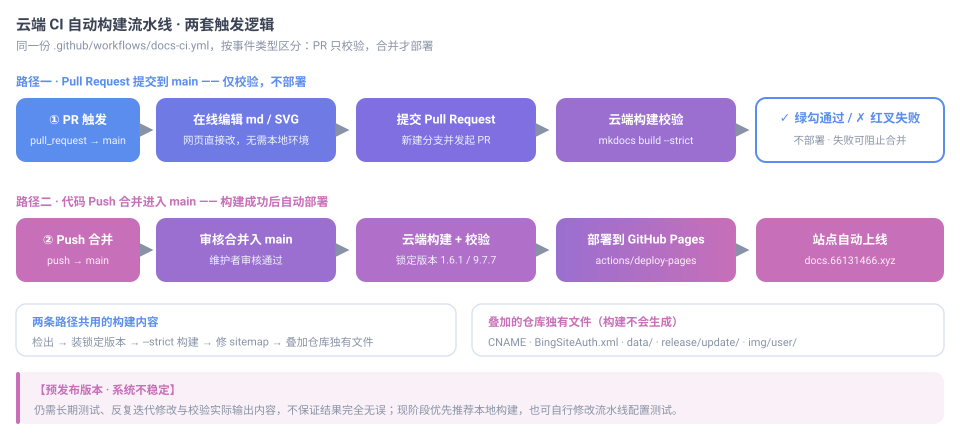

# 云端 CI 自动构建流水线

> **【v1.0.4.2 重大新增功能：云端 CI 自动构建流水线】**

本页说明 v1.0.4.2 引入的 GitHub Actions 云端自动构建流水线，以及它带来的两种文档贡献方式。

## 预发布声明

> **【重要声明 · 务必阅读】**
>
> 当前这套 CI 云端构建系统属于**预发布版本**，**系统不稳定，仍需要长期测试、反复迭代修改与校验实际输出内容，不保证输出结果完全无误**。现阶段依然**优先推荐本地构建方式**。用户可以自行修改、调试这套流水线相关配置用于测试。

该声明同时保留在本页、[开发者文档首页](index.md) 与版本更新日志中，未经维护者确认请勿删除。

## 版本说明：v1.0.4.2 改变了什么

v1.0.4.2 是一次**重大更新**：引入 GitHub Actions 云端自动构建流水线，把「构建」这件事从贡献者的电脑上搬到了云端。

**原有模式**：全部贡献者都必须**本地搭建环境**——安装 Python、安装锁定版本的 MkDocs 与 Material 主题、克隆仓库，改完之后还要在本地跑一次 `mkdocs build` 自检，确认没有报错才敢提交。

**新模式**：贡献者**可以选**本地构建，也**完全可以不配置本地环境**，直接在网页上在线提交修改，云端自动完成全部构建校验。构建结果会以检查项的形式回显在 Pull Request 上。

> **重要提示**：本系统为预发布版本，尚未稳定，需长期反复测试校验，不保证构建结果完全可靠，优先推荐本地构建；你也可以自行修改流水线配置进行测试。

相比旧的纯本地自构建模式，这套流水线**大幅降低了贡献门槛**：省去本地安装依赖的繁琐操作、节省贡献者自己的本地算力（一次全站构建约 850 秒，风扇转满、机器发烫），也降低新手的上手学习成本——不必先学会一套工具链，才能改一个错别字。

## 两种贡献方式

下面介绍两套并行的贡献方案。它们不是二选一的对立关系，而是**按你的情况挑一条更顺手的路**。

### 方式 A：云端自动构建（轻度贡献可选，预发布测试状态）

**适合**：偶尔改几个错别字、补一段说明、修一个失效链接的轻度贡献者；电脑上没有环境、装不上 Python、或不愿意为此折腾的成员；只想专注于写作、不想碰工具链的新手。

**操作流程**：

1. **在线编辑**：在 GitHub 网页上打开要改的 Markdown 或 SVG，点铅笔图标直接编辑；新增文件则用 **Add file → Create new file**
2. **提交 PR**：保存时选择「新建分支并发起 Pull Request」，把改动提交上去
3. **云端自动构建**：GitHub Actions 自动触发，在云端完成环境准备与 `mkdocs build --strict` 构建校验
4. **查看结果**：
   - 构建通过 → PR 上显示**绿色对勾**，同时可以下载云端构建出的完整产物自行预览
   - 构建失败 → PR 上显示**红色叉号**，并给出具体的报错位置，修正后重新提交即可
5. **审核合并**：维护者审核内容，合并进 `main`
6. **自动上线**：合并后流水线再次构建，成功后自动部署到 GitHub Pages，站点更新

整个过程你**不需要安装任何东西**，也不用在本地跑任何命令。

**局限**：受预发布状态影响，云端构建结果**不保证完全可靠**，偶尔可能出现环境差异导致的失败或输出偏差；出现这种情况时，可改走方式 B 在本地复现排查，或在 PR 中反馈给维护者。

### 方式 B：本地自构建（现阶段优先推荐）

**适合**：需要频繁改动、要调导航与主题配置、或对产物正确性要求较高的成员；以及希望改动**在提交前就确认无误**的谨慎型贡献者。

**操作流程**：

1. 按[环境搭建](../start/)安装 Python、锁定版本的 MkDocs 与 Material 主题，克隆仓库
2. 在本地编辑内容，用 `mkdocs serve` 实时预览效果
3. 提交前跑一次 `mkdocs build --strict` 自检，确认零警告、零报错
4. 提交分支、发起 Pull Request（详见[提交与上线流程](../contribute/)）
5. 云端流水线同样会跑一遍校验，作为**双重保险**；合并后自动部署

本地构建的好处是**反馈最快、结果最确定**：改一个字马上就能在浏览器里看到，不必等云端排队；构建版本与线上严格一致，产物可控。代价是需要先花一点时间把环境搭起来——这正是方式 A 想替轻度贡献者省掉的部分。

## 流水线的两套触发逻辑

同一份配置文件 `.github/workflows/docs-ci.yml` 承担两种职责，按事件类型区分：

| 触发事件 | 执行内容 | 是否部署 |
|---|---|---|
| **Pull Request → main** | 仅执行构建校验（`mkdocs build --strict`） | **不部署**，只给出检查结果 |
| **Push / 合并 → main** | 构建校验，通过后自动部署静态站点到 GitHub Pages | **自动部署** |

### 为什么 PR 阶段不部署

PR 阶段只校验、不部署，是为了让**尚未经过审核的内容不会意外上线**。构建失败会以红色叉号显示在 PR 上，配合仓库的分支保护规则即可**阻止合并**，从机制上避免把构建不过的改动并进主分支。

### 为什么合并后才部署

`main` 是站点的发布分支。只有在改动经审核合并之后，流水线才执行部署，把构建产物发布到 GitHub Pages。这样「合并」与「上线」是同一个动作，不会出现主分支内容与线上不一致的中间状态。

## 构建都做了哪些事

流水线不只是跑一句 `mkdocs build`，它会依次完成：

1. **检出仓库**（保留完整 git 历史——站点地图需要提交时间作为 `lastmod`）
2. **安装锁定版本的构建环境**：`mkdocs==1.6.1` 与 `mkdocs-material==9.7.7`，并**核对版本号**，不一致立即失败
3. **严格构建**：`mkdocs build --strict`，任何警告都视为失败
4. **统计产物**：输出页面数与产物体积，便于比对
5. **修正站点地图**：剔除 MkDocs 自动生成的 sitemap，落回本站定制版
6. **核对 sitemap 收录情况**（仅提示，不阻断——新增页面需在发布后重新生成 sitemap 才会被收录）
7. **叠加仓库独有文件**：`CNAME`、`BingSiteAuth.xml`、`data/`、`release/update/` 子站数据、`img/user/` 头像资源等构建不会生成、但线上必须存在的文件
8. **上传产物**：PR 阶段作为可下载的校验产物，push 阶段作为 Pages 部署产物

> **版本锁定不可放松**。不同版本的 MkDocs / Material 会改变生成的页面结构、`meta generator` 与页眉页脚。流水线会主动核对版本，就是为了保证云端产物与线上逐字一致。

## 自行修改与调试

你可以**自由修改、调试**这套流水线配置用于测试——把 `.github/workflows/docs-ci.yml` 复制到自己 fork 的仓库里，改完推送即可在 Actions 页面看到运行结果，不会影响本仓库。

常见可调项：

| 想做的事 | 改哪里 |
|---|---|
| 换 Python 版本 | `env.PYTHON_VERSION` |
| 换构建版本 | `env.MKDOCS_VERSION`、`env.MATERIAL_VERSION` |
| 产物目录改名 | `env.SITE_DIR` |
| 加一条自己的校验 | 在 `build` 作业的 `steps` 中追加 |
| 让 PR 阶段也部署 | 去掉部署相关步骤的 `if: github.event_name == 'push'`（**不建议**，会让未审核内容上线） |

> 调试时请注意：`--strict` 会把**任何警告**升级为失败。若你新增的内容触发了告警（例如链接校验、图片缺失），PR 会直接红叉，这是预期行为，按报错提示修正即可。

## 常见问题

**PR 上出现红叉，但我看本地没问题？**
先展开失败步骤的日志，定位具体报错行。最常见的原因是**新增页面未在 `mkdocs.yml` 的 `nav` 中登记**、图片路径写错、或链接指向了不存在的页面。云端与本地用的是同一套锁定版本，若本地通过而云端失败，多半是漏提交了某个文件。

**能只校验不部署吗？**
可以。向 `main` 发 PR 时天然只校验不部署；只有合并进 `main` 才会部署。

**部署失败了怎么办？**
先确认仓库 `Settings → Pages → Source` 已选择「GitHub Actions」。若仍为「Deploy from a branch」，部署步骤会失败。该项为仓库管理员设置，普通贡献者无法修改，请联系维护者。

**这套系统稳定吗？能依赖它吗？**
**不稳定，不要依赖。** 它目前是预发布版本，仍需长期测试、反复迭代修改与校验实际输出内容，不保证输出结果完全无误。**现阶段依然优先推荐本地构建方式**；云端流水线是给轻度贡献者的便捷通道，以及给所有贡献者的双重保险。

**我改了流水线文件会不会影响线上？**
会。`.github/workflows/docs-ci.yml` 属于仓库配置，合并进 `main` 后即对全仓库生效。若只是自己测试，请在 fork 中修改，不要向本仓库提交未经确认的流水线改动。

## 相关文档

- [开发者文档首页](index.md) —— 贡献方式总览与板块索引
- [提交与上线流程](../contribute/) —— 分支、Commit、PR 的完整协作流程
- [环境搭建](../start/) —— 本地构建环境的安装步骤
- [导航与站点配置](../nav-config/) —— 新增页面时登记 `nav` 的写法
- [Sitemap 生成与维护](../sitemap/) —— 新页面发布后如何更新站点地图
