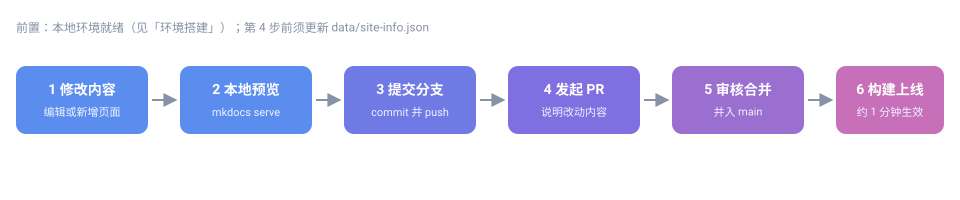

# 提交与上线流程

本教程说明文档从本地修改到正式上线的完整链路。撰写规范见 [Markdown 写作规范](../writing/)，环境问题见 [环境搭建](../start/)。

## 流程总览

从改动到上线共六个阶段，后一步依赖前一步的产物：



其中前三步在本地完成，第 4 步起进入 GitHub 协作，最后由维护者构建发布。

## 1. 修改内容

按[环境搭建](../start/)准备好本地环境后，在仓库中编辑或新增页面。新增页面需要在站点配置的 `nav` 中登记才会出现在导航里（写法见[导航与站点配置](../nav-config/)）。

## 2. 本地预览

```bash
mkdocs serve
```

浏览器打开 <http://127.0.0.1:8000>，确认：

- 标题层级、表格、列表渲染正常
- 图片能显示、站内外链接可跳转
- 搜索能搜到你新增的关键词

## 3. 提交分支

```bash
git checkout -b docs/my-edit   # 新建分支，起一个见名知意的名字
git add .
git commit -m "docs: 简要说明本次改动"
git push origin docs/my-edit
```

Commit 信息建议以 `docs:` 开头，一句话说明改了什么。

### 提交前更新站点版本信息 {#site-info}

本站的版本号与最后更新日期集中存放在**单一数据文件** `data/site-info.json` 中，页面上显示的「站点信息」即读取该文件，避免多处硬编码导致不一致。

```json
{
  "meta": {
    "schema_version": "1.0",
    "note": "文档站版本信息。version 随结构性调整递增；updated 取本站最近一次提交日期（建议在 PR 提交前更新）。"
  },
  "site": {
    "version": "v1.0.0",
    "updated": "2026-10-04"
  }
}
```

**在发起 Pull Request 之前**，请按以下规则更新它（当前展示值见[关于本站 · 站点信息](../../about/site-info/)）：

| 字段 | 何时修改 | 填写规则 |
|---|---|---|
| `site.updated` | **每次改动都要更新** | 填本次提交日期，格式 `YYYY-MM-DD` |
| `site.version` | 仅在**结构性调整**时递增 | 语义化版本 `主.次.修订` |

版本号的递增口径：

- **主版本**（`v2.0.0`）：站点整体重构，如导航体系、目录结构或技术栈变更
- **次版本**（`v1.1.0`）：新增栏目、教程或页面等向后兼容的内容扩充
- **修订号**（`v1.0.1`）：错别字修正、失效链接修复、措辞优化等小改动

修改示例：

```bash
# 1) 编辑数据文件
#    结构性调整：v1.0.0 → v1.1.0
#    普通维护：   v1.0.0 保持不变
#    updated 一律改为当天日期
vim data/site-info.json

# 2) 确认 JSON 合法（可选，需已安装 python3）
python3 -m json.tool data/site-info.json

# 3) 与本次改动一起提交
git add data/site-info.json
git commit -m "docs: 更新站点版本信息"
```

> **注意**：`data/site-info.json` 必须保持为合法 JSON——多余逗号或缺失引号会导致「关于」页的站点信息无法读取。提交前请用上面的命令校验一次。

## 4. Pull Request

推送后打开 [GitHub 仓库](https://github.com/eoccc/eoccc.github.io)页面，点击 **Compare & pull request**：

- 标题一句话概括改动
- 正文写明：改了哪些页面、为什么改、截图（涉及排版时）

提交后等待审核。

不装本地环境也可以：在 GitHub 网页上打开要改的文件，点铅笔图标直接编辑，保存时选择「新建分支并发起 PR」，效果相同。

## 5. 审核合并与上线

维护者审核通过后合并入 `main`，随后构建静态产物推送发布，GitHub Pages 自动更新，通常 1 分钟内生效。

合并后看不到变化？多为浏览器缓存，强制刷新（Ctrl+F5）即可。

## 注意事项

> **注意**：仓库根目录的 `CNAME`（自定义域名配置）与 `release/update/` 子站由维护者管理，普通贡献请勿改动。

## 提 Issue 与写 PR

无论反馈问题还是提交改动，仓库都提供了结构化模板，按提示填写即可，无需自己组织格式。

### 提 Issue

在 [GitHub 仓库](https://github.com/eoccc/eoccc.github.io/issues)点击 **New issue**，按问题性质选择模板：

| 模板 | 适用场景 | 必填要点 |
|---|---|---|
| **文档错误修正** | 错别字、表述不清、链接失效、示例有误 | 问题页面、问题类型、现状、建议改为 |
| **站点功能异常** | 搜索失效、导航异常、深浅色切换失灵、图片不显示 | 页面地址、涉及功能、复现步骤、期望结果 |
| **内容或结构建议** | 新增教程、调整章节、补充图示、改进导航 | 建议类型、涉及板块、想解决的问题、建议方案 |

模板中的「问题类型」「涉及功能」「建议类型」均为下拉选择，选最贴近的一项即可；填写完成后会自动打上对应标签（`documentation`、`bug`、`enhancement`），便于维护者归类。

> **提示**：仓库已关闭空白 Issue 入口。若你的问题更适合直接改文档，用上面的「想直接改文档」入口按 PR 流程提交会更快。

### 写 PR 描述

发起 Pull Request 时，描述框会自动载入模板，包含四部分：

1. **改动说明** —— 一句话概括，再逐条列出具体改动
2. **改动类型** —— 勾选适用项（错别字、失效链接、新增页面、示意图、导航调整等）
3. **涉及页面** —— 列出改动到的页面路径或标题，便于定位
4. **提交前自查** —— 逐项确认本地预览、链接可跳转、新增页面已登记导航、未误改 `CNAME` 与 `release/update/`、版本信息已更新

自查项对应本教程前面各步；勾选过程即是一次完整复查，建议提交前逐条过一遍。

遇到其他问题，可在 [GitHub 仓库](https://github.com/eoccc/eoccc.github.io/issues)提交 Issue。相关阅读：[GitHub 开发与软件包发布流程](../github-release-flow/)。
