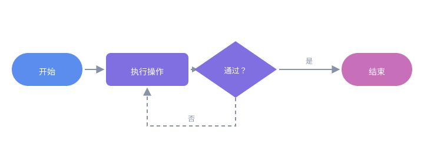

# 流程图开发与创作

本教程面向参与本站文档配图的成员，说明如何使用 SVG 绘制一张结构清晰、风格统一的流程图。

流程图用图形表达「步骤、判断与先后顺序」，适合说明构建上线、发布审批、故障排查等有明确流程的场景。绘制前建议先读 [SVG 图标绘制与创作](../svg-guide/)，本教程只讲流程图特有的部分。

## 先想清楚，再动手

画图前先回答四个问题，可以避免反复返工：

| 问题 | 作用 |
|---|---|
| 流程从哪开始、到哪结束？ | 确定起点与终点，画出主干 |
| 一共几个步骤？ | 决定横向还是纵向排布 |
| 哪里有判断分支？ | 确定菱形节点与分叉位置 |
| 哪些步骤可以并行？ | 确定是否需要并列泳道 |

> **提示**：把步骤先用文字列成有序列表，再逐一转成图形，比直接拖拽绘图更快也更不容易漏项。

## 构成要素

一张流程图通常只有四类节点加一种连线，不必追求花哨：

| 要素 | 形状 | 含义 |
|---|---|---|
| 起止 | 圆角矩形 / 胶囊 | 流程的开始与结束 |
| 处理 | 矩形 | 一个具体操作步骤 |
| 判断 | 菱形 | 需要分支的条件 |
| 数据 | 平行四边形 | 输入或输出 |
| 连线 | 带箭头的线段 | 执行方向 |

## 画布与坐标系

先用 `viewBox` 划定画布，再按网格摆放节点，能保证对齐、间距一致。推荐以 **20 为步长** 布局：

```xml
<svg xmlns="http://www.w3.org/2000/svg" viewBox="0 0 960 320"
     role="img" aria-label="流程示例">
  <!-- 画布逻辑坐标：0..960 × 0..320 -->
</svg>
```

横向流程与纵向流程的常见取值：

| 布局 | 节点尺寸 | 水平间距 | 垂直间距 |
|---|---|---|---|
| 横向（4～5 步） | 190 × 140 | 40 | — |
| 纵向（4～5 步） | 240 × 60 | — | 40 |

## 节点样式

沿用 [SVG 图标绘制与创作](../svg-guide/) 中的品牌色，并用**圆角**统一观感：

```xml
<!-- 处理节点：主色填充 + 圆角 -->
<rect x="40" y="60" width="190" height="140" rx="10" fill="#5b8def"/>

<!-- 节点标题：白字、加粗、水平居中 -->
<text x="135" y="100" text-anchor="middle"
      font-family="Roboto, 'Segoe UI', Arial, sans-serif"
      font-size="17" font-weight="700" fill="#ffffff">1 · 开发</text>

<!-- 节点说明：次级白字，字号更小 -->
<text x="135" y="132" text-anchor="middle"
      font-family="Roboto, 'Segoe UI', Arial, sans-serif"
      font-size="12" fill="#eef2ff">本地实现与自测</text>
```

按流程推进顺序使用渐深的品牌色，读者能直观感受到「推进」：

| 阶段 | 建议色值 |
|---|---|
| 起始 / 第 1 步 | `#5b8def` |
| 中间步骤 | `#7f6fe0` |
| 结束 / 强调 | `#c76fb8` |
| 连线与箭头 | `#8892a6` |

## 连接线与箭头

箭头用 `<defs>` 定义一次，之后通过 `marker-end` 复用：

```xml
<defs>
  <marker id="flowArrow" viewBox="0 0 10 10" refX="9" refY="5"
          markerWidth="7" markerHeight="7" orient="auto-start-reverse">
    <path d="M0,0 L10,5 L0,10 z" fill="#8892a6"/>
  </marker>
</defs>

<!-- 从节点右侧连到下一个节点左侧 -->
<line x1="234" y1="130" x2="266" y2="130"
      stroke="#8892a6" stroke-width="2" marker-end="url(#flowArrow)"/>
```

要点：

- `refX` / `refY` 决定箭头锚点，取值不当会出现「箭头扎进节点」或「留缝」
- `orient="auto-start-reverse"` 让箭头自动跟随线段方向，折线也适用
- 连接线两端要留出 2～4 的间隙，视觉上更利落

> **注意**：多个流程图出现在同一页面时，`id` 必须互相区分（如 `flowArrow`、`devArrow`），否则后加载的会覆盖先前的箭头样式。

## 分支与循环

分支用**菱形**表示，出口标注条件；循环则让连线回到上游节点：

```xml
<!-- 判断节点：菱形用 polygon 表达 -->
<polygon points="480,60 570,110 480,160 390,110" fill="#7f6fe0"/>

<!-- 分支标签：写在连线中点上方 -->
<text x="620" y="104" text-anchor="middle" font-size="12" fill="#8892a6">是</text>

<!-- 回到上游：折线绕行，避免穿过其他节点 -->
<polyline points="480,160 480,200 135,200 135,196"
          fill="none" stroke="#8892a6" stroke-width="2"
          marker-end="url(#flowArrow)"/>
```

分支绘制建议：

- 每个分支出口都标明条件（`是` / `否`，或具体判定值）
- 折线绕行时与其他节点保持至少 20 的间距
- 回到上游的回流线用**虚线**，与主干区分：

```xml
<line x1="480" y1="200" x2="135" y2="200" stroke="#8892a6"
      stroke-width="2" stroke-dasharray="6 5" marker-end="url(#flowArrow)"/>
```

## 可访问性

流程图信息密度高，必须让屏幕阅读器能读到主干，而不是逐个朗读图形元素：

```xml
<svg xmlns="http://www.w3.org/2000/svg" viewBox="0 0 960 320"
     role="img" aria-label="开发到发布流程：开发、评审、构建、发布四个阶段">
  <title>开发到发布流程</title>
  <desc>流程依次为：本地开发、提交评审、构建制品、发布上线，底部为贯穿全流程的版本与日志要素。</desc>
  <!-- 图形元素 -->
</svg>
```

- `role="img"`：把整张图当作一个整体，避免碎片化朗读
- `aria-label`：一句话概括流程走向
- `<desc>`：补充分支条件等细节

## 在文档中引用

绘制完成后存入 `ext/svg/`，用**内联 ``** 引用：

```html

```

存放目录、命名、`alt` 写法与「必须用内联 `` 而非 ``」等引用约定，与 SVG 教程完全一致，见 [SVG 图标绘制与创作 · 在文档中引用](svg-guide/#_11)。

## 自查清单

发布前逐项确认：

1. **主干完整**：从起点到终点无断头路，每个分支都有归宿
2. **方向一致**：横向流程的箭头统一向右，纵向统一向下
3. **对齐规整**：节点按网格摆放，同排节点尺寸与间距一致
4. **文字可读**：字号不小于 12，深色底用白字、浅色底用深字
5. **配色统一**：使用品牌色，不引入体系外的高饱和色
6. **间距合理**：连线不穿字、不压节点，回流线与其他元素保持 20 以上间距
7. **可访问**：`role` / `aria-label` / `<title>` / `<desc>` 齐备

## 完整实例

下面是一张最小可用的四步流程图，含起点、处理、判断与回流：


对应的骨架结构：

```xml
<svg xmlns="http://www.w3.org/2000/svg" viewBox="0 0 720 240" role="img" aria-label="示例流程">
  <defs>
    <marker id="sampleFlowArrow" viewBox="0 0 10 10" refX="9" refY="5"
            markerWidth="7" markerHeight="7" orient="auto-start-reverse">
      <path d="M0,0 L10,5 L0,10 z" fill="#8892a6"/>
    </marker>
  </defs>

  <!-- 起点 -->
  <rect x="20" y="90" width="120" height="56" rx="28" fill="#5b8def"/>
  <text x="80" y="122" text-anchor="middle" font-size="14" fill="#ffffff">开始</text>

  <!-- 连线 -->
  <line x1="144" y1="118" x2="176" y2="118" stroke="#8892a6"
        stroke-width="2" marker-end="url(#sampleFlowArrow)"/>

  <!-- 处理 -->
  <rect x="180" y="90" width="140" height="56" rx="8" fill="#7f6fe0"/>
  <text x="250" y="122" text-anchor="middle" font-size="14" fill="#ffffff">执行操作</text>

  <!-- 判断 -->
  <polygon points="400,70 470,118 400,166 330,118" fill="#7f6fe0"/>
  <text x="400" y="123" text-anchor="middle" font-size="13" fill="#ffffff">通过？</text>

  <!-- 结束 -->
  <rect x="580" y="90" width="120" height="56" rx="28" fill="#c76fb8"/>
  <text x="640" y="122" text-anchor="middle" font-size="14" fill="#ffffff">结束</text>
</svg>
```

## 相关阅读

- [SVG 图标绘制与创作](../svg-guide/)：基础语法、viewBox、路径指令与配色规范
- [Markdown 写作规范](../writing/)：文档撰写与资源引用写法
- [提交与上线流程](../contribute/)：改动从提交到上线的链路
- [GitHub 开发与软件包发布流程](../github-release-flow/)：资源与素材规范的完整约定
