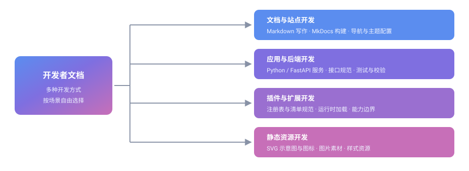

# GitHub 开发与软件包发布流程

本教程面向参与社区项目开发的成员，说明在 GitHub 上从写代码到发布一个可用软件包的完整流程。

开发者文档并不局限于 GitHub 这一条路径：本站按「开发方式」组织内容，你可以根据自己的角色和目标选择入口。下图给出全貌。



| 开发方式 | 典型内容 | 入口 |
|---|---|---|
| 文档与站点开发 | Markdown 写作、MkDocs 构建、导航与主题配置 | [环境搭建](../start/)、[Markdown 写作规范](../writing/)、[导航与站点配置](../nav-config/) |
| 应用与后端开发 | Python / FastAPI 服务、接口规范、测试与校验 | 本文「[开发流程](#dev-flow)」 |
| 插件与扩展开发 | 注册表与清单规范、运行时加载、能力边界 | 本文「[开发流程](#dev-flow)」 |
| 静态资源开发 | SVG 示意图与图标、图片素材、样式资源 | 本文「[资源与素材规范](#assets)」 |

无论选择哪种方式，只要产出需要交给社区使用，最终都会汇入同一条发布链路——这正是本文的重点。

## 项目来源与主要开发者

| 项目 | 说明 |
|---|---|
| 源仓库 | [github.com/EveryOneCreate/EveryoneCreate](https://github.com/EveryOneCreate/EveryoneCreate) |
| 主要开发者 | Kevin Station（[@Kevincn2010](https://github.com/Kevincn2010)） |
| 许可 | 遵循源仓库所在许可（GPL-3.0） |

<table>
<tr>
<td width="72"></td>
<td><strong>Kevin Station</strong>（<a href="https://github.com/Kevincn2010" target="_blank" rel="noopener">GitHub 主页</a>）<br>Everyone Create Community（每个人创作社区）主要开发者，负责社区项目与文档体系的设计与维护。</td>
</tr>
</table>

> 头像资源存放在仓库本地目录（`img/user/`），不通过外部网络接口加载，详见「[资源与素材规范](#assets)」。

## 项目概览

本节说明本流程所服务的项目对象，内容对应源仓库的项目文档（源文档代号 **GitAAP**），语义保持不变。

### 项目简介

Everyone Create Community（每个人创作社区）的模块化项目，是一个开源的 API 聚合代理服务，专注于 GitHub 仓库数据的采集与可视化。它通过多 Token 调度、智能缓存层和插件化架构，将分散在多个页面的仓库信息整合到一处统一面板。

### 核心能力

| 能力 | 说明 |
|---|---|
| 仓库数据聚合 | 自动采集仓库流量、发布、Issue、PR 等数据，集中展示 |
| 多 Token 调度 | 同时管理多个访问令牌，按剩余配额自动轮换，用完无缝切换 |
| 智能缓存 | 请求结果按命名空间缓存，减少重复调用，提升响应速度 |
| 插件体系 | 运行时动态加载的功能模块，支持弹窗、外观、验证等扩展 |
| 多语言界面 | 内置简体中文、繁体中文、英文，自动适配 |
| 主题系统 | 12 套色彩方案（琥珀、竹、炭、霜、薰衣草、樱花等） |
| 全异步架构 | 基于 FastAPI + httpx，高效并发处理 |
| 容器化部署 | Docker Compose 编排，一条命令启动 |

> **AI 辅助开发声明**：本项目由 AI 辅助生成，可能存在考虑不周或疏漏之处。如果你发现任何问题或有优化建议，欢迎提交 [Issue](https://github.com/EveryOneCreate/EveryoneCreate/issues) 或 [Pull Request](https://github.com/EveryOneCreate/EveryoneCreate/pulls) 指点斧正。每一份反馈都是让这个项目变得更好的动力。

### 许可证

项目以 **GPL-3.0** 许可发布，版权归属 KevinCN2010（Kevin Station）。使用时请遵循源仓库的许可条款，保留版权声明与许可文本。

## 环境与部署

### 部署方式

**方式一：Docker Compose（推荐）**

```bash
git clone https://github.com/EveryOneCreate/EveryoneCreate.git
cd EveryoneCreate
cp .env.example .env
# 编辑 .env 填入 Token 与仓库列表
docker compose up -d
# 访问 http://localhost:4000
```

**方式二：手动部署**

```bash
python3 -m venv venv
source venv/bin/activate
pip install -r requirements.txt
uvicorn i18n.main:app --host 0.0.0.0 --port 8000 --reload
```

### 环境变量

| 变量 | 必需 | 默认值 | 说明 |
|---|---|---|---|
| `GITHUB_TOKEN` | 是 | — | 访问令牌 |
| `GITHUB_TOKENS` | 否 | — | 多令牌模式，`名称=Token,名称2=Token2` |
| `REPOS` | 否 | 见下 | 监控仓库，`owner/repo` 逗号分隔 |
| `UPDATE_HOURS` | 否 | `6` | 更新间隔（小时） |
| `ADMIN_PASSWORD` | 否 | 随机 | 管理后台密码 |

> **安全提示**：Token 属于敏感凭证，请勿写入仓库或提交到版本库；仅通过本地 `.env` 或部署环境的密钥管理注入。

## 项目结构

模块目录的组成如下，便于按模块定位代码与文档：

```
gitaap/
├── backend/               # 后端核心
│   ├── app.py             # FastAPI 应用入口
│   ├── models/            # 数据库模型
│   ├── services/
│   │   ├── cache.py          # 智能缓存
│   │   ├── token_manager.py  # 多 Token 调度器
│   │   └── predictor.py      # 流量预测
│   └── utils/             # 工具函数
├── i18n/                  # 国际化 & 前端
│   ├── main.py            # 路由 & 请求处理
│   ├── templates/         # Jinja2 HTML 模板
│   └── static/
│       ├── lang/          # 多语言 JSON
│       ├── themes/        # 12 套主题 CSS
│       ├── plugins/       # 插件系统
│       └── icons/         # SVG 图标库
├── ipapi/                 # IP 归属地查询（独立进程）
├── tests/                 # 测试用例
├── docker-compose.yml     # Docker 编排
├── pyproject.toml         # 项目元数据
└── requirements.txt       # Python 依赖
```

## 插件体系

插件是运行时动态加载的功能模块，目录结构如下：

```
i18n/static/plugins/
├── registry.json         # 插件注册索引
├── core/                 # 加载器核心
│   ├── loader.js
│   └── manager.js
└── available/            # 预置插件
    ├── info-popups/          # 信息弹窗
    ├── appearance-tools/     # 外观设置
    ├── captcha-verify/       # 人机验证
    ├── legal-compliance/     # 法律合规提示
    ├── repo-mirror/          # 仓库镜像
    └── traffic-predict/      # 流量预测
```

插件通过 `registry.json` 登记、由加载器在运行时装配；新增插件需同时维护注册索引与清单文件，发布流程与主项目一致（见下文「[开发](#dev-flow)」至「[发布](#release)」）。

## 流程总览

开发到发布共四个阶段，前后衔接、可回溯：


| 阶段 | 关键动作 | 产出 |
|---|---|---|
| 1 · 开发 | 拉取分支、实现功能、本地自测 | 可运行的改动 |
| 2 · 评审 | 提交 Pull Request、代码审查、合并 | 合入 `main` 的代码 |
| 3 · 构建 | 打包、生成校验信息、归档 | 待发布的制品 |
| 4 · 发布 | 打 Tag、创建 Release、同步更新日志 | 对外可下载的软件包 |

## 1. 开发 {#dev-flow}

### 准备环境

```bash
git clone https://github.com/EveryOneCreate/EveryoneCreate.git
cd EveryoneCreate

# 创建并切换到功能分支，名字要能说明用途
git checkout -b feature/your-feature
```

分支命名建议使用前缀区分用途：

| 前缀 | 用途 | 示例 |
|---|---|---|
| `feature/` | 新增功能 | `feature/token-rotation` |
| `fix/` | 修复缺陷 | `fix/cache-expire` |
| `docs/` | 文档改动 | `docs/release-guide` |

### 编写与自测

- 小步提交，一次提交只做一件事，便于回滚与审查
- 提交信息遵循 [Conventional Commits](https://www.conventionalcommits.org/zh-hans/)：`feat:`、`fix:`、`docs:`、`chore:` 等
- 提交前在本地跑通测试与静态检查（以源仓库的 `pyproject.toml`、`requirements.txt` 为准）

```bash
# 安装依赖（含开发依赖）
pip install -e ".[dev]"

# 运行测试与静态检查
pytest
ruff check .
ruff format .
```

## 2. 评审

```bash
git add .
git commit -m "feat: 简述本次改动"
git push origin feature/your-feature
```

推送后到源仓库页面点击 **Compare & pull request** 发起 Pull Request：

- 标题一句话概括改动
- 正文写明：改了什么、为什么改、如何验证
- 涉及界面或排版的改动，附上截图或录屏

维护者审查通过后合并入 `main`。评审意见需要修改时，继续向同一分支提交即可，PR 会自动更新。

## 3. 构建

合并后即可进入构建阶段。构建的目标是把源码变成**可分发、可校验**的制品：

| 动作 | 说明 |
|---|---|
| 打包 | 生成源码包或容器镜像等制品 |
| 校验 | 生成校验信息（如哈希值），供使用者核对完整性 |
| 归档 | 把制品放到固定的发布目录或制品库 |

```bash
# 以 Python 项目为例：构建源码包与 wheel 包
python -m build

# 生成校验文件，随制品一同发布
sha256sum dist/* > dist/SHA256SUMS
```

构建产物应可复现：同样的源码与配置，任何人构建都应得到一致的结果。

## 4. 发布 {#release}

### 打 Tag 标记版本

版本号建议遵循[语义化版本](https://semver.org/lang/zh-CN/)：`主版本.次版本.修订号`。

```bash
git tag -a v1.0.0 -m "v1.0.0"
git push origin v1.0.0
```

### 创建 GitHub Release

1. 进入源仓库的 **Releases** 页面，点击 **Draft a new release**
2. 选择刚推送的 Tag，填写标题与发布说明
3. 上传第 3 步构建出的制品与校验文件
4. 确认无误后点击 **Publish release**

发布说明建议包含：新增功能、问题修复、不兼容变更、升级方式。

### 同步更新日志

发布完成后，把本次版本的内容同步到本站的[版本更新日志](../../release/update/)，让使用者能集中查看每个版本的变化与下载入口。

> **提示**：版本更新日志子站（仓库根目录 `release/update/`）由维护者管理，其内容生成流程独立于 MkDocs，普通贡献请勿直接改动，见[关于本站](../../about/)的注意事项。

## 资源与素材规范 {#assets}

文档中引用的图片、头像与示意图一律**存放在仓库本地、以相对路径引用**，不通过外部网络加载。

### 目录分工

| 目录 | 用途 | 示例 |
|---|---|---|
| `img/user/` | 用户头像（预留） | `img/user/kevin-station.svg` |
| `ext/` | 扩展静态资源（预留），其下按类型分子目录 | `ext/svg/github-release-flow.svg` |
| `assets/` | 站点主题自带资源，请勿手动改动 | `assets/images/favicon.png` |

### 头像

- 推荐把头像作为仓库内的本地文件引用；也支持直接使用外部头像链接（如各类头像接口、Gravatar 等）
- 使用外部链接时，可用性取决于对方服务，可能因防盗链、改版或下线而失效；长期展示的头像优先用本地文件
- 文件名用「英文小写 + 连字符」，与成员一一对应
- 引用时写清替代文字：

```html

```

### SVG

SVG 不限于按钮，也可以用于示意图、流程图与概念说明。绘制与引用约定：

- 使用 `viewBox`，并标注 `role="img"` 与 `aria-label`（或 `<title>` / `<desc>`）保证可访问性
- 图形自带配色，不依赖页面 CSS 变量，以兼容站点的明暗两种主题
- 不使用外部字体、外部图片与脚本引用

```html

```

> **注意**：站外资源可用性取决于对方服务，可能因防盗链、改版或下线而失效；长期展示的资源优先放入 `img/user/` 或 `ext/`，并在[导航与站点配置](../nav-config/)中确认引用路径。

## 相关阅读

- [环境搭建](../start/)：本地开发环境与预览
- [Markdown 写作规范](../writing/)：文档撰写与资源引用写法
- [提交与上线流程](../contribute/)：文档从修改到上线的链路
- [导航与站点配置](../nav-config/)：站点结构与导航登记

遇到问题可在[源仓库](https://github.com/EveryOneCreate/EveryoneCreate/issues)或[文档仓库](https://github.com/eoccc/eoccc.github.io/issues)提交 Issue。
