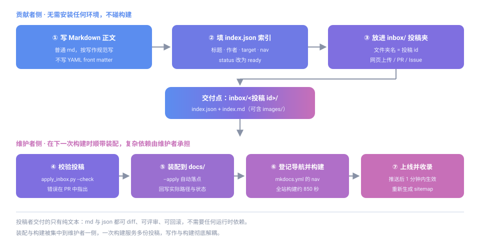

# 投稿区：零门槛参与共建

本页说明**不需要任何本地环境**的投稿方式。如果你不想装 Python、不想跑 MkDocs、也不想学导航配置，走这条路就对了。



## 为什么要单独设一个投稿区

本站由 MkDocs + Material 主题构建，一次全站构建约 **850 秒**，并且必须锁定 `mkdocs==1.6.1` 与 `mkdocs-material==9.7.7`——版本稍有偏差，页眉、`meta generator` 与导航结构就会变形，产物无法与线上对齐。

这套约束对**维护者**是必要的，对**作者**却是纯粹的负担。所以本站把两件事拆开：

| | 传统方式 | 投稿区方式 |
|---|---|---|
| 安装 Python / MkDocs | 必须 | **不需要** |
| 学 `mkdocs.yml` 导航语法 | 必须 | **不需要** |
| 本地 `mkdocs serve` 预览 | 必须 | **不需要** |
| 构建 850 秒 | 自己跑 | **维护者顺带跑** |
| 你实际要做的 | 全都要 | **写 md + 填 json** |

> **复杂构件与装配依赖，交给有环境、有经验的人。** 你只负责把内容写好。

## 你要做的两件事

### 第一步：建投稿文件夹

在仓库的 `inbox/` 目录下新建一个文件夹，**文件夹名就是投稿 id**：

```
inbox/
└── my-first-article/        ← 投稿 id（小写字母、数字、连字符）
    ├── index.json           ← 索引文件，必填
    └── index.md             ← 正文，必填
```

id 只能用**小写字母、数字和连字符 `-`**，例如 `mindustry-server-guide`、`json-tips-01`。

> 省事做法：复制 `inbox/_template/` 整个文件夹，重命名成你的 id 再改内容。

### 第二步：填索引文件

```json
{
  "schema_version": "1.0",
  "id": "my-first-article",
  "title": "我的第一篇投稿",
  "author": "你的昵称",
  "date": "2026-10-06",
  "summary": "一句话说明这篇写了什么。",
  "target": "wiki/community",
  "nav": ["Wiki", "社区投稿", "我的第一篇投稿"],
  "tags": ["教程", "入门"],
  "files": ["index.md"],
  "assets": ["images"],
  "status": "ready",
  "notes": ""
}
```

## 索引文件字段规范

| 字段 | 必填 | 说明 |
|---|---|---|
| `schema_version` | 是 | 固定填 `"1.0"` |
| `id` | 是 | **必须与文件夹名完全一致**，小写字母、数字、连字符 |
| `title` | 是 | 页面标题，会成为正文的 `#` 一级标题 |
| `author` | 是 | 署名 |
| `date` | 是 | 投稿日期，严格 `YYYY-MM-DD` |
| `summary` | 是 | 一句话摘要，建议 40 字以内，不要换行 |
| `target` | 是 | 目标板块，取值见下表 |
| `nav` | 否 | 你期望的导航位置，维护者据此登记 `mkdocs.yml` |
| `tags` | 否 | 标签，用于归类与检索 |
| `files` | 是 | 随投稿的正文文件，**必须包含 `index.md`** |
| `assets` | 否 | 图片等资源，相对投稿文件夹的路径 |
| `license` | 否 | 默认 `"CC BY-SA 4.0"`，与本站一致 |
| `status` | 是 | `draft` 草稿 / `ready` 可装配 / `done` 维护者已装配 |
| `notes` | 否 | 给维护者的补充说明 |

### target 取值

| target | 落点 | 适合什么 |
|---|---|---|
| `wiki` | `docs/wiki/` | 条目式技术知识、操作备忘（最常用） |
| `wiki/community` | `docs/wiki/community/` | 成员经验分享、教程、踩坑记录 |
| `dev` | `docs/dev/` | 参与共建的流程与规范 |
| `faq` | `docs/faq/` | 问答式排障内容 |
| `about` | `docs/about/` | 站点自身的说明 |

不确定选哪个就填 `wiki/community`，维护者装配时会帮你归位。

## 正文写作要求

正文按 [Markdown 写作规范](../writing/) 写。三条最要紧的：

1. **只用一个 `#` 一级标题**，章节用 `##`、小节用 `###`，不要跳级
2. **不要写 YAML front matter**（开头那对 `---`）。本站未启用 `meta` 扩展，写了会当正文原样显示——元数据**只写在 `index.json`** 里
3. **图片用相对路径**，文件一起放进投稿文件夹：

   ```
   inbox/my-first-article/
   ├── index.json
   ├── index.md
   └── images/
       └── step-1.png     ← 正文写 
   ```

> 正文里不要写站内绝对路径（如 `/dev/writing/`）。装配后层级会变，相对路径由维护者统一校正。

## 投稿前自检

- [ ] 文件夹名与 `index.json` 的 `id` **完全一致**，只用小写字母、数字、连字符
- [ ] `index.json` 是**合法 JSON**（可在 <https://jsonlint.com> 粘贴校验，注意别多写逗号）
- [ ] `date` 是 `YYYY-MM-DD` 格式
- [ ] `files` 列出了所有正文文件，且**包含 `index.md`**
- [ ] 正文只有一个 `#` 一级标题，没有 YAML front matter
- [ ] 图片都在投稿文件夹内，用相对路径引用
- [ ] `status` 已改为 `ready`

## 怎么提交

三种方式任选，**都不需要本地环境**：

| 方式 | 操作 | 适合 |
|---|---|---|
| **网页上传**（推荐） | 在 GitHub 打开 `inbox/`，点 **Add file → Upload files** 拖入文件夹，提交时选「新建分支并发起 PR」 | 所有人 |
| **Pull Request** | 会 Git 的话照常 fork → 提交 → PR，只提交 `inbox/` 下内容 | 熟悉 Git 的人 |
| **Issue 附件** | 把 `index.json` 与 md 内容贴在 [Issue](https://github.com/eoccc/eoccc.github.io/issues) 里 | 完全不想碰 Git 的人 |

**你不需要**：跑构建、改 `mkdocs.yml`、碰 `docs/` 目录、更新 `data/site-info.json`、生成 sitemap。

## 维护者如何装配

投稿区配有校验与装配工具 `tools/apply_inbox.py`：

```bash
# 只校验，不改动任何文件（投稿者可自行运行，需 Python 3）
python3 tools/apply_inbox.py --check

# 校验通过后装配到 docs/ 对应目录，并回写实际落点
python3 tools/apply_inbox.py --apply

# 预览将要执行的动作，不实际写入
python3 tools/apply_inbox.py --apply --dry-run
```

工具会校验必填字段、`id` 与文件夹名一致性、日期格式、`target` 合法性、`files` 是否含 `index.md`、正文是否含 front matter 或多余一级标题，并检查落点是否与既有栏目冲突。装配后会输出需要在 `mkdocs.yml` 中登记的导航片段。

维护者收到投稿后的完整流程：

1. `python3 tools/apply_inbox.py --check` 校验
2. `python3 tools/apply_inbox.py --apply` 装配到 `docs/`
3. 按输出的片段在 `mkdocs.yml` 的 `nav` 中登记导航
4. 更新 `data/site-info.json` 的 `version` 与 `updated`（见[提交与上线流程](../contribute/#site-info)）
5. 构建全站（约 850 秒）并落地产物
6. 重新生成 sitemap（见 [Sitemap 生成与维护](../sitemap/)），提交推送

## 常见问题

**不会写 JSON，怕格式错？**
复制 `inbox/_template/index.json` 改字段值即可，别动结构。提交后维护者也会跑校验，格式问题会在 PR 里指出，不会直接拒收。

**只有想法、没有正文，能投稿吗？**
可以。填好 `index.json`，说明你想写什么，维护者会帮你判断放在哪、需要什么格式。

**投稿后多久上线？**
取决于构建排期——本站构建一次 850 秒且需锁定版本环境，所以是**攒够一批一起构建**，不保证即时。急件请在 `notes` 里写明。

**能投稿代码或配置文件吗？**
可以，用代码块包起来并标注语言。代码块内的内容**保持原样不翻译**，这是本站的既定规则。

**装配后 `inbox/` 里的文件还在吗？**
在。投稿区保留原始投稿与索引作为归档与追溯依据，`status` 会被标记为 `done` 并附上实际落点路径。

## 相关文档

- [Markdown 写作规范](../writing/) —— 正文怎么写
- [提交与上线流程](../contribute/) —— 完整协作流程与版本信息维护
- [导航与站点配置](../nav-config/) —— 维护者登记导航时参考
- [投稿区规范原文](https://github.com/eoccc/eoccc.github.io/blob/main/inbox/README.md) —— 仓库内 `inbox/README.md`
