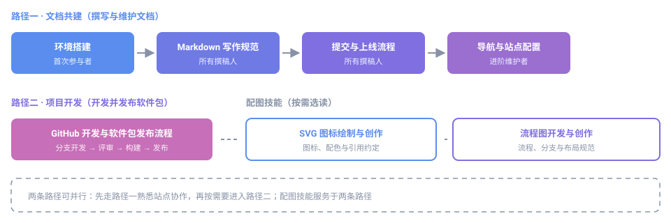

# 开发者文档

欢迎参与 Everyone Create Community（每个人创作社区）共建。本板块按参与方向分为两类，可按自己的角色直接进入对应路径。

## 文档共建

面向参与本站文档撰写与站点维护的成员。

| 教程 | 内容 | 适合谁 |
|---|---|---|
| [投稿区：零门槛参与共建](inbox/) | **不需要本地环境**：写 Markdown、填索引文件、放进 `inbox/`，由维护者顺带装配构建 | 首次参与者、装不上环境的人 |
| [环境搭建](start/) | 安装 Python、MkDocs、克隆仓库，跑起本地预览 | 需要本地预览的参与者 |
| [Markdown 写作规范](writing/) | 标题层级、列表、表格、图片引用的统一写法 | 所有撰稿人 |
| [提交与上线流程](contribute/) | 分支、Commit、Pull Request 到自动上线的完整链路 | 所有撰稿人 |
| [导航与站点配置](nav-config/) | mkdocs.yml 的 nav 折叠菜单写法与新页面登记 | 进阶维护者 |
| [SVG 图标绘制与创作](svg-guide/) | viewBox、图形元素、路径指令、品牌配色与引用约定 | 需要配图的成员 |
| [流程图开发与创作](flowchart-guide/) | 节点与连线、分支与循环、布局对齐与自查清单 | 需要配图的成员 |

## 项目开发

面向参与社区项目开发与软件包发布的成员。

| 教程 | 内容 | 适合谁 |
|---|---|---|
| [GitHub 开发与软件包发布流程](github-release-flow/) | 多种开发方式入口、分支与提交规范、构建与 GitHub Release 发布、资源与素材规范 | 参与项目开发者 |

##  学习路径建议

本板块按参与方向分两条路径，可先走「文档共建」熟悉协作，再按需要进入「项目开发」：



1. 第一次参与文档共建：按顺序读完 **环境搭建** 和 **Markdown 写作规范**，即可开始写文档
2. 写完之后：按 **提交与上线流程** 提交，等待审核合并
3. 想帮社区调整站点结构（加栏目、改导航）：再看 **导航与站点配置**
4. 要开发并发布一个软件包：看 **GitHub 开发与软件包发布流程**

需要为文档配图时，可进一步阅读 [SVG 图标绘制与创作](svg-guide/) 与 [流程图开发与创作](flowchart-guide/)。

##  快速备忘

```bash
mkdocs serve      # 本地预览，保存即刷新
mkdocs build      # 构建静态产物到 site/
```

遇到问题先查[关于本站](../about/)的常见说明，仍无法解决可在 [GitHub 仓库](https://github.com/eoccc/eoccc.github.io)提 Issue。
