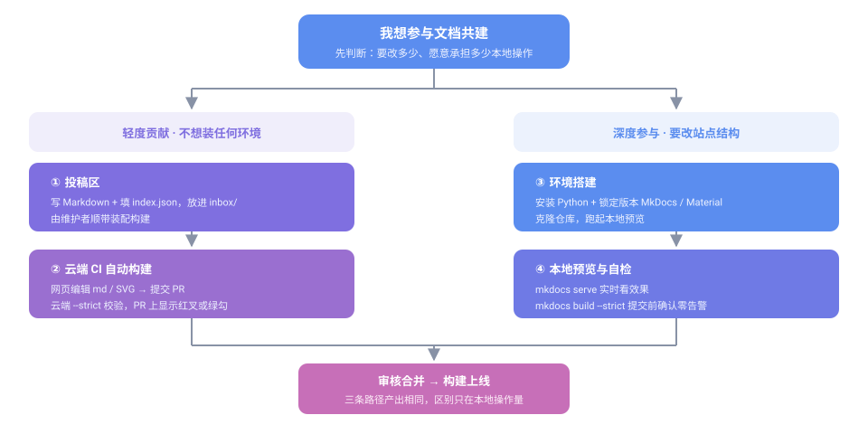

# 开发者文档

欢迎参与 Everyone Create Community（每个人创作社区）共建。本板块面向**文档撰写者与站点维护者**，按「你要做的事」分成四组，可直接跳到对应分组。

## 我该从哪里开始

不知道走哪条路，按下面这张图对号入座：



一句话版本：

| 你的情况 | 走这条路 |
|---|---|
| 只想改错别字、补一段说明，不想装任何东西 | [投稿区](inbox/) |
| 会在网页上编辑、愿意提 PR，但不想装环境 | [云端 CI 自动构建流水线](ci-build/) |
| 要频繁改动、调导航或主题，要求产物确定 | [环境搭建](start/) → [提交与上线流程](contribute/) |
| 要发布软件包 | [GitHub 开发与软件包发布流程](github-release-flow/) |

> **关于云端构建的现状**：该流水线属**预发布版本，系统不稳定**，仍需长期测试、反复迭代修改与校验实际输出内容，**不保证输出结果完全无误**。现阶段依然**优先推荐本地构建方式**，你也可以自行修改、调试流水线配置用于测试。详见 [云端 CI 自动构建流水线](ci-build/)。

## 参与方式

先确定用什么方式把你的改动送进来。三条路径的产出相同，区别只在「你愿意承担多少本地操作」。

| 教程 | 内容 | 适合谁 |
|---|---|---|
| [投稿区：零门槛参与共建](inbox/) | **不需要本地环境**：写 Markdown、填索引文件、放进 `inbox/`，由维护者顺带装配构建 | 首次参与者、装不上环境的人 |
| [云端 CI 自动构建流水线](ci-build/) | PR 仅校验不部署、合并后自动部署；两套贡献方案与预发布声明 | 轻度贡献者、无本地环境的成员 |
| [环境搭建](start/) | 安装 Python、MkDocs、克隆仓库，跑起本地预览 | 需要本地预览与自检的参与者 |
| [提交与上线流程](contribute/) | 分支、Commit、Pull Request 到上线的完整链路，含 Issue / PR 模板用法 | 所有撰稿人 |

## 写作与配图

内容怎么写、图怎么画。**语法**层面的系统讲解在 Wiki 的[编程语言与数据格式](../wiki/langs/)板块，这里只讲**本站规范**与**作图方法**。

| 教程 | 内容 | 适合谁 |
|---|---|---|
| [Markdown 写作规范](writing/) | 本站的风格约定：标题层级、命名用词、图片与链接的存放引用 | 所有撰稿人 |
| [SVG 图标绘制与创作](svg-guide/) | viewBox、图形元素、路径指令、品牌配色与引用约定 | 需要配图的成员 |
| [流程图开发与创作](flowchart-guide/) | 节点与连线、分支与循环、布局对齐与自查清单 | 需要配图的成员 |

> **语法 vs 规范**：Markdown 的**语法**（怎么写才渲染正确）见 [Wiki · Markdown 语法详解](../wiki/langs/markdown/)；本页的**写作规范**（怎么写才风格统一）是本站的额外约定。两者配合阅读。

## 站点维护

改动站点结构、导航与搜索引擎收录。这类改动影响全站，建议先用[环境搭建](start/)配好本地预览再动手。

| 教程 | 内容 | 适合谁 |
|---|---|---|
| [导航与站点配置](nav-config/) | `mkdocs.yml` 的 `nav` 折叠菜单写法、新页面登记与站点元信息 | 进阶维护者 |
| [Sitemap 生成与维护](sitemap/) | 站点地图的生成方式、新增页面后如何更新与校验 | 进阶维护者 |

## 项目开发

面向参与社区项目开发与软件包发布的成员。

| 教程 | 内容 | 适合谁 |
|---|---|---|
| [GitHub 开发与软件包发布流程](github-release-flow/) | 多种开发方式入口、分支与提交规范、构建与 GitHub Release 发布、资源与素材规范 | 参与项目开发者 |

## 常见入口速查

| 我想…… | 去哪里 |
|---|---|
| 改一个错别字 | [投稿区](inbox/) |
| 弄清云端构建是怎么回事 | [云端 CI 自动构建流水线](ci-build/) |
| 让本地能预览站点 | [环境搭建](start/) |
| 知道 PR 该怎么提 | [提交与上线流程](contribute/) |
| 查某个 Markdown 语法怎么写 | [Wiki · Markdown 语法详解](../wiki/langs/markdown/) |
| 给文档配一张示意图 | [SVG 图标绘制与创作](svg-guide/) |
| 加一个页面并让它出现在侧边栏 | [导航与站点配置](nav-config/) |
| 让搜索引擎收录新页面 | [Sitemap 生成与维护](sitemap/) |

## 快速备忘

```bash
mkdocs serve      # 本地预览，保存即刷新
mkdocs build      # 构建静态产物到 site/
```

遇到问题先查[关于本站](../about/)的常见说明，仍无法解决可在 [GitHub 仓库](https://github.com/eoccc/eoccc.github.io)提 Issue。
