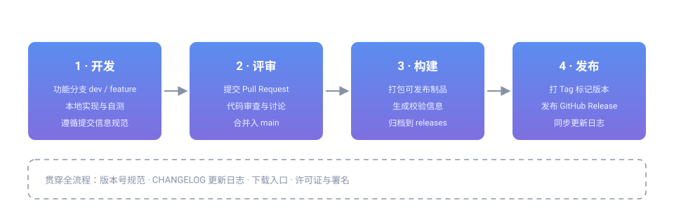

# SVG 图标绘制与创作

本教程面向参与本站文档配图的成员，说明如何从零绘制一个 SVG 图标或示意图，并按照社区约定接入文档。

SVG 是矢量格式，放大不失真、体积小、可直接用文本编辑，非常适合示意图、流程图与图标。本站的 SVG 一律**存放在仓库本地目录、以相对路径引用**，不使用站外链接。

## 为什么用 SVG

| 优势 | 说明 |
|---|---|
| 矢量清晰 | 任意缩放不失真，高分屏与打印同样清晰 |
| 体积小 | 纯文本描述图形，通常只有几百字节到几 KB |
| 可编辑 | 用文本编辑器即可修改颜色、尺寸与结构 |
| 可访问 | 可通过 `role`、`aria-label` 等属性描述图形含义 |
| 可复用 | 同一份文件可在多处引用，改一处即全部生效 |

## 最小可用示例

一个 SVG 从 `<svg>` 根元素开始，用 `viewBox` 定义坐标系，再放入图形元素：

```xml
<svg xmlns="http://www.w3.org/2000/svg" viewBox="0 0 24 24" width="24" height="24" role="img" aria-label="心形图标">
  <path d="M12 21s-7-4.35-7-9.5A4.5 4.5 0 0 1 12 8a4.5 4.5 0 0 1 7 3.5C19 16.65 12 21 12 21z" fill="#5b8def"/>
</svg>
```

要点：

- 必须带 `xmlns="http://www.w3.org/2000/svg"`，否则作为独立文件打开时无法渲染
- `viewBox="0 0 minX minY 宽 高"` 决定坐标系，是缩放的关键
- `width` / `height` 是默认显示尺寸，可被引用处的属性覆盖

## viewBox：坐标系的基石

`viewBox` 的四个数字依次是**原点 x、原点 y、宽度、高度**。它定义「画布逻辑坐标」，与实际显示像素无关：

```xml
<!-- 坐标范围 0..24：适合图标 -->
<svg xmlns="http://www.w3.org/2000/svg" viewBox="0 0 24 24">…</svg>

<!-- 坐标范围 0..960 × 0..320：适合宽幅示意图 -->
<svg xmlns="http://www.w3.org/2000/svg" viewBox="0 0 960 320">…</svg>
```

只要 `viewBox` 不变，图形内容就固定；引用时改 `width`，图形会等比缩放。

> **提示**：绘制前先定 `viewBox`，后续所有坐标都基于它计算，可避免元素「跑偏」或被裁掉。

## 常用图形元素

| 元素 | 用途 | 关键属性 |
|---|---|---|
| `<rect>` | 矩形、卡片、按钮底色 | `x` `y` `width` `height` `rx`（圆角） |
| `<circle>` | 圆形、头像底、节点 | `cx` `cy` `r` |
| `<ellipse>` | 椭圆 | `cx` `cy` `rx` `ry` |
| `<line>` | 直线、连接线 | `x1` `y1` `x2` `y2` |
| `<polyline>` / `<polygon>` | 折线 / 多边形箭头 | `points` |
| `<path>` | 任意形状、图标轮廓 | `d`（路径指令） |
| `<text>` | 图上文字 | `x` `y` `font-size` `text-anchor` |

一个包含多种元素的示例：

```xml
<svg xmlns="http://www.w3.org/2000/svg" viewBox="0 0 240 120" role="img" aria-label="流程节点示意">
  <!-- 卡片 -->
  <rect x="10" y="30" width="90" height="60" rx="8" fill="#5b8def"/>
  <!-- 箭头连线 -->
  <line x1="105" y1="60" x2="135" y2="60" stroke="#8892a6" stroke-width="2"/>
  <polygon points="135,55 145,60 135,65" fill="#8892a6"/>
  <!-- 终点 -->
  <circle cx="175" cy="60" r="20" fill="#7f6fe0"/>
  <!-- 标注 -->
  <text x="55" y="65" text-anchor="middle" font-size="13" fill="#ffffff">开始</text>
</svg>
```

## 路径指令速查

`<path>` 的 `d` 由指令与坐标组成，掌握几个常用指令即可画大多数图标：

| 指令 | 含义 | 示例 |
|---|---|---|
| `M x y` | 移动到（起点） | `M12 3` |
| `L x y` | 画直线到 | `L20 15` |
| `H x` / `V y` | 水平 / 垂直线 | `H24` / `V10` |
| `C` / `Q` | 三次 / 二次贝塞尔曲线 | `C4 4 8 4 8 8` |
| `A` | 圆弧 | `A5 5 0 0 1 20 20` |
| `Z` | 闭合路径 | `Z` |

> **提示**：先用设计工具（如 Inkscape、Figma）画好再导出 SVG，然后手工清理导出的冗余属性，是最快的方式。

## 颜色与填充

社区品牌色如下，绘制示意图时请优先使用，以保持全站视觉统一：

| 用途 | 色值 | 说明 |
|---|---|---|
| 主色 | `#5b8def` | 起始节点、主要区块 |
| 辅色 | `#7f6fe0` | 过渡节点、次级区块 |
| 强调色 | `#c76fb8` | 终点、需要强调的元素 |
| 中性色 | `#8892a6` | 连线、箭头、说明文字 |

```xml
<rect x="0" y="0" width="40" height="40" fill="#5b8def"/>
<rect x="50" y="0" width="40" height="40" fill="#7f6fe0" stroke="#c76fb8" stroke-width="2"/>
```

渐变色用 `<defs>` 定义、再通过 `url(#id)` 引用：

```xml
<svg xmlns="http://www.w3.org/2000/svg" viewBox="0 0 120 40" role="img" aria-label="渐变示意">
  <defs>
    <linearGradient id="demoGrad" x1="0" y1="0" x2="1" y2="1">
      <stop offset="0%" stop-color="#5b8def"/>
      <stop offset="100%" stop-color="#c76fb8"/>
    </linearGradient>
  </defs>
  <rect x="0" y="0" width="120" height="40" rx="8" fill="url(#demoGrad)"/>
</svg>
```

> **注意**：`<defs>` 中 `id` 需在**同一文件内唯一**。若同一页面引入多个 SVG，请给 `id` 加前缀（如 `flowArrow`、`devArrow`），避免互相覆盖。

## 可访问性

图形不是装饰时，必须让屏幕阅读器能理解它：

```xml
<svg xmlns="http://www.w3.org/2000/svg" viewBox="0 0 24 24"
     role="img" aria-label="下载图标">
  <title>下载图标</title>
  <desc>向下的箭头，用于表示下载操作</desc>
  <path d="M12 3v12m0 0l-4-4m4 4l4-4M4 19h16" fill="none" stroke="#5b8def" stroke-width="2"/>
</svg>
```

- `role="img"`：声明这是一张图，而非一组可交互元素
- `aria-label`：供屏幕阅读器朗读的简短名称
- `<title>` / `<desc>`：更完整的标题与描述，鼠标悬停也会显示 `<title>`

装饰性图形应加 `aria-hidden="true"`，避免朗读噪音。

## 在文档中引用

把绘制好的 SVG 存入本地目录，再用**内联 ``** 引用：

```html

```

本站的目录约定：

| 目录 | 用途 |
|---|---|
| `ext/svg/` | 示意图、流程图、概念图（本教程相关资源） |
| `img/user/` | 用户头像 |

约定要点：

- 文件名用「英文小写 + 连字符」，例如 `github-release-flow.svg`
- 必须写 `alt`，内容说明图形含义（不要写「图片」两字）
- 一律本地相对路径，**禁止**引用站外 SVG 或外部图片接口
- 图形自带配色，不依赖页面 CSS 变量，以兼容站点明暗两种主题

> **注意**：正文中的本地 SVG 请用内联 `` 标签。若用 Markdown 的 `` 语法，MkDocs 会把它当作需校验的文档链接，触发「目标不在文档文件之中」的构建警告。

## 优化与检查

绘制完成后，按下面几步自查：

1. **精简**：删除设计工具导出的冗余属性（编辑器元数据、空的 `<g>`、未使用的 `<defs>`）
2. **坐标**：确认所有元素都在 `viewBox` 范围内，未被裁切
3. **配色**：优先使用上文品牌色，避免引入体系外的高饱和色
4. **可访问**：`role` / `aria-label` / `<title>` 齐备
5. **体积**：单文件建议控制在 10 KB 以内，必要时用工具压缩路径精度

```bash
# 若安装了 svgo，可自动压缩（可选，非必须）
npx svgo ext/svg/your-icon.svg
```

## 完整实例

下面是一个可直接复用的节点卡片图标，含渐变、圆角与文字：


对应的源码结构：

```xml
<svg xmlns="http://www.w3.org/2000/svg" viewBox="0 0 320 120" role="img" aria-label="渐变圆角卡片示例">
  <title>渐变圆角卡片示例</title>
  <defs>
    <linearGradient id="cardGrad" x1="0" y1="0" x2="1" y2="1">
      <stop offset="0%" stop-color="#5b8def"/>
      <stop offset="100%" stop-color="#7f6fe0"/>
    </linearGradient>
  </defs>
  <rect x="16" y="24" width="288" height="72" rx="12" fill="url(#cardGrad)"/>
  <text x="160" y="66" text-anchor="middle" font-size="16" font-weight="700"
        font-family="Roboto, 'Segoe UI', Arial, sans-serif" fill="#ffffff">SVG 示例卡片</text>
</svg>
```

## 相关阅读

- [流程图开发与创作](../flowchart-guide/)：用 SVG 绘制流程图，含节点、连线与分支规范
- [Markdown 写作规范](../writing/)：文档撰写与资源引用写法
- [提交与上线流程](../contribute/)：改动从提交到上线的链路
- [GitHub 开发与软件包发布流程](../github-release-flow/)：资源与素材规范的完整约定

