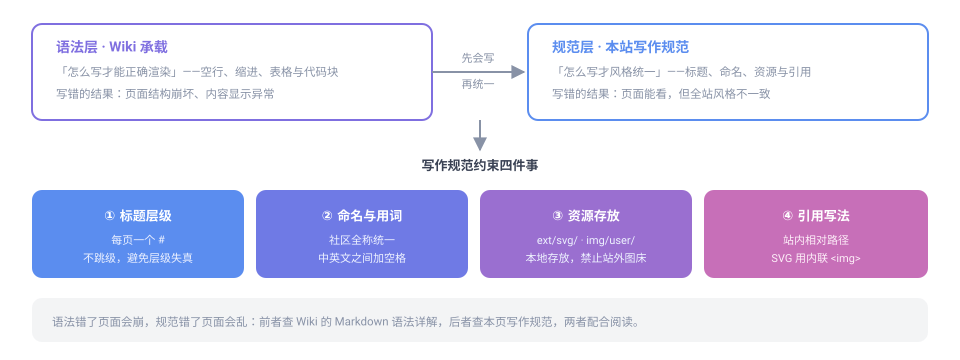

# Markdown 写作规范

本页讲**本站的风格约定**——命名、用词、章节组织、资源存放。至于 Markdown 语法本身（怎么写才渲染正确），见 [Wiki · Markdown 语法详解](../../wiki/langs/markdown/)。

**分工**：语法错了页面会崩，规范错了页面会乱。前者看 Wiki，后者看本页。



## 标题层级

每页**只有一个** `#`（一级标题），章节用 `##`，小节用 `###`，不要跳级。


跳级或缺少一级标题不仅影响观感，还会让页内目录与全站搜索索引的层级失真。

## 段落与列表

- 段落之间空一行；不要用空格缩进段首
- 并列内容用无序列表 `-`；有步骤先后关系用有序列表 `1. 2. 3.`
- 列表项保持在两行以内，过长内容拆成小节

## 表格

表格用于**结构化对照信息**（如功能说明、字段含义、错误码），不要拿表格排版普通段落。表头加粗由渲染器自动处理，无需手写。

## 资源存放与引用

这是本站最容易出错的一环，规则是「**按用途分目录，一律相对路径**」：

| 资源类型 | 存放位置 | 引用写法 |
|---|---|---|
| 示意图、流程图、图标 | `ext/svg/` | `` |
| 成员头像等个人素材 | `img/user/` | `` |
| 页面配图（截图等） | 与页面同级或 `ext/img/` | `` |

- 文件名用**英文小写加连字符**，如 `dev-entry-flow.svg`
- 图片**必须写替代文字**（`alt`），便于无障碍阅读与搜索
- SVG 用**内联 ``** 引用而非 ``，以免触发 MkDocs 链接校验警告
- 长期展示的资源**一律本地存放**，不要依赖站外图床（对方改版或下线就会失效）

> 配图的绘制方法见 [SVG 图标绘制与创作](svg-guide/) 与 [流程图开发与创作](flowchart-guide/)。

## 链接

- **站内**用相对路径，如 `[环境搭建](start.md)`；指向目录时以 `/` 结尾，如 `[Wiki](../wiki/)`
- **站外**写完整 URL
- 链接文字要能说明去向，**避免「点这里」**这类无信息量的写法

> 路径写错的链接不会报错，只会变成 404。发布前建议逐个点开确认。

## 代码块

命令、配置、代码一律用代码块并**标注语言**；不确定时用 `text`。

```bash
mkdocs serve
```

**本站特殊规则**：Mindustry 相关文档中，代码块内的内容**保持原样不翻译**（代码、配置、脚本、变量、指令），注释与正文按实际情况汉化。详见 [Mindustry 汉化规则](../wiki/mindustry/zh/index.md)。

## 提醒与注意

重要提示用引用块突出显示，并在开头点明类型：

```markdown
> **提示**：这里是一段提示内容

> **注意**：请勿删除仓库根目录的 CNAME 文件
```

> **提示**：本站未启用 admonition 扩展，请使用上面的引用块写法，不要直接写 `!!!` 语法。

## 命名与用词

- 社区全称统一写 **Everyone Create Community（每个人创作社区）**，不要使用旧称或自造缩写
- 文档名用英文小写加连字符（如 `getting-started.md`），页面内首行标题可用中文
- 中英文之间加一个空格，如「使用 MkDocs 构建」

写完之后，请按 [提交与上线流程](../contribute/) 提交你的改动。
