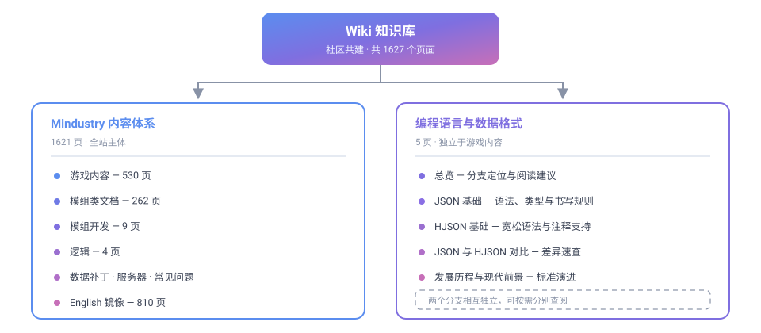

# Wiki 知识库

Wiki 是本站的**条目式知识库**，面向 Mindustry 内容体系与通用数据格式，提供可直接查阅、可交叉引用的技术文档。与面向流程指引的[开发者文档](../dev/)、面向问答的[常见问题](../faq/)不同，Wiki 承载的是**结构化、成体系、可长期沉淀**的知识内容。

## 两大知识分支

Wiki 当前由两个相互独立的分支构成，可按需要直接进入：

| 分支 | 规模 | 定位 | 适合谁 |
|---|---|---|---|
| [Mindustry 内容体系](mindustry/zh/) | 1621 页 | 游戏内容的完整技术参考：方块、物品、液体、单位、状态、星球与模组开发 | 模组作者、服主、内容研究者 |
| [编程语言与数据格式](langs/) | 5 页 | 配置载体格式的语法与用法：JSON、HJSON 及其相互关系 | 需要读写配置文件与撰写文档的成员 |

两个分支**互不依赖**：查阅游戏内容不必了解数据格式，反之亦然。两者在「数据补丁」与「模组开发」处交汇，需要时可交叉阅读。

## Mindustry 内容体系

Mindustry 的全部游戏内容均以结构化数据描述，Wiki 对其做了系统整理，并按语言提供双语版本。

| 板块 | 内容 |
|---|---|
| [中文版](mindustry/zh/) | 汉化后的完整内容体系，含游戏内容、模组类文档、模组开发、逻辑等分支 |
| [English](mindustry/en/) | 与中文版页面一一对应的英文原版，便于对照上游术语 |
| [变更日志](mindustry/CHANGELOG.md) | 内容导入与同步记录 |

中文版的主要分支：

| 分支 | 页数 | 内容 |
|---|---|---|
| 游戏内容 | 530 | 方块（制造、防御、物流、液体、电力、生产、炮塔、单位工厂等）、物品、液体、星球、状态、单位 |
| 模组类文档 | 262 | Java 类的字段、类型、默认值与说明 |
| 模组开发 | 9 | 入门、插件与 JVM 模组、脚本、精灵图制作、标记语言、类型、迁移指南 |
| 逻辑 | 4 | 简介、术语表、代码编写与编辑、变量与常量 |
| 其他 | 5 | 总览、数据补丁、常见问题、服务器界面构建器、服务器 |

## 编程语言与数据格式

Mindustry 的模组、数据补丁与内容定义以 **JSON** 及其超集 **HJSON** 为配置载体。本分支讲解这两种格式的语法、特性与相互关系。

| 页面 | 内容 |
|---|---|
| [总览](langs/) | 分支定位、语言关系、格式选择速查 |
| [JSON 基础](langs/json/) | 语法结构、两种容器、六种数据类型、书写规则、校验方法 |
| [HJSON 基础](langs/hjson/) | 设计目标、相对 JSON 放宽的四个方面、仍须遵守的规则、常见误区 |
| [JSON 与 HJSON 对比](langs/compare/) | 语法差异速查、逐项对照、转换方式、选用建议 |
| [发展历程与现代前景](langs/json-history/) | 标准化里程碑、生态现状、方言与替代方案 |

##  查阅路径

| 你的目的 | 建议入口 |
|---|---|
| 查询某个方块、物品或单位的属性 | [游戏内容](mindustry/zh/) |
| 编写或调试模组内容 | [模组类文档](mindustry/zh/Modding%2520Classes/) |
| 了解如何开始制作模组 | [模组开发入门](mindustry/zh/modding/1-modding/) |
| 编写数据补丁 | [数据补丁](mindustry/zh/datapatches/) |
| 弄清配置文件该用哪种格式 | [编程语言与数据格式](langs/) |
| 对照英文原文与术语 | [English](mindustry/en/) |

## 内容组织原则

Wiki 的内容遵循以下约定，以保证可长期维护：

| 原则 | 说明 |
|---|---|
| **条目化** | 每个页面聚焦一个主题，可独立查阅与链接 |
| **可交叉引用** | 页面之间通过链接关联，而非重复叙述 |
| **术语统一** | 类名、字段名、变量名等技术标识符保留英文原样 |
| **代码不翻译** | 代码块、配置、指令保持原文，仅注释与正文翻译 |
| **与上游同步** | Mindustry 内容跟随上游版本更新，变更记入变更日志 |

##  与站内其他板块的分工

| 板块 | 承载内容 |
|---|---|
| **Wiki**（本板块） | 条目式技术知识：内容参考、格式语法、类文档 |
| [开发者文档](../dev/) | 流程指引：环境搭建、写作规范、提交上线、配图创作 |
| [常见问题](../faq/) | 问答式排查：账号、服务器、资源、报错 |
| [版本更新日志](../release/) | 版本变更记录与发布说明 |
| [社区公约](../rules/) | 社区规则与议事程序 |

## 如何贡献条目

Wiki 内容与站点其他页面采用同一套协作方式：

1. 按[环境搭建](../dev/start/)准备好本地环境
2. 依 [Markdown 写作规范](../dev/writing/) 与 [Markdown 语法详解](langs/markdown/) 撰写内容
3. 按[提交与上线流程](../dev/contribute/)提交 Pull Request
4. 需要配图时，参考 [SVG 图标绘制与创作](../dev/svg-guide/) 与 [流程图开发与创作](../dev/flowchart-guide/)

仓库已提供结构化模板，填写提示见[提交与上线流程 · 提 Issue 与写 PR](../dev/contribute/#issue-pr)。

## 待补充方向

以下方向尚无页面覆盖，可优先补充：

| 方向 | 说明 |
|---|---|
| 各平台客户端安装与配置 | 桌面端、移动端的安装与常见配置备忘 |
| 常用外部工具与资源 | 地图编辑器、材质工具、资源站点的使用速记 |
| 服务器联机排错 | 端口、防火墙、版本不一致等常见问题的速查 |
| 文档站维护操作 | 站点结构、导航、构建相关的操作备忘 |
| 其他数据格式 | 如 YAML、TOML 等配置格式的语法讲解 |
