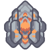
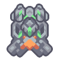

#  Additive Reconstructor

*"Upgrades inputted units to the second tier."*

| Property | Value |
|---|---|
| **General** |  |
| Health | 360 |
| Size | 3x3 |
| Build Time | 4.266  seconds |
| Build Cost |  200  120  90 |
| **Power** |  |
| Power Use | 180  power units/second |
| **Items** |  |
| Item Capacity | 80  items |
| **Input/Output** |  |
| Input |  40
 • Silicon |
| 4/sec  40
 • Graphite |  |
| 4/sec |  |
| Output |  Nova  Pulsar
 Dagger  Mace
 Crawler  Atrax
 Flare  Horizon
 Mono  Poly
 Risso  Minke
 Retusa  Oxynoe |
| Production Time | 10  seconds |
