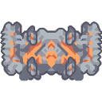

#  Exponential Reconstructor

*"Upgrades inputted units to the fourth tier."*

| Property | Value |
|---|---|
| **General** |  |
| Health | 3035 |
| Size | 7x7 |
| Build Time | 106.5  seconds |
| Build Cost |  2.0null  2.0null  750  1.0null  450  600 |
| **Power** |  |
| Power Use | 780  power units/second |
| **Liquids** |  |
| Liquid Capacity | 600  liquid units |
| **Items** |  |
| Item Capacity | 1700  items |
| **Input/Output** |  |
| Input |  850
 • Silicon |
| 9.444/sec  750
 • Titanium |  |
| 8.333/sec  650
 • Plastanium |  |
| 7.222/sec   60 /sec Cryofluid |  |
| Output |  Zenith  Antumbra
 Spiroct  Arkyid
 Fortress  Scepter
 Bryde  Sei
 Mega  Quad
 Quasar  Vela
 Cyerce  Aegires |
| Production Time | 90  seconds |
