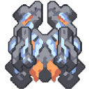

#  Mech Assembler

*"Assembles large mechs out of inputted blocks and units. Output tier may be increased by adding modules."*

| Property | Value |
|---|---|
| **General** |  |
| Health | 3600 |
| Size | 5x5 |
| Build Time | 46.75  seconds |
| Build Cost |  600  1.0null  550  200  200 |
| **Power** |  |
| Power Use | 180  power units/second |
| **Liquids** |  |
| Liquid Capacity | 120  liquid units |
| **Items** |  |
| Item Capacity | 10  items |
| **Input/Output** |  |
| Input |  12 /sec Cyanogen |
| Output |  Tecta 70 seconds  5  12
 Collaris 180 seconds Module Tier: 1  6  20 |
