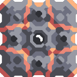
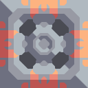
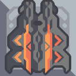
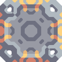

#  Water

*"Used for cooling machines and waste processing."*

| Property | Value |
|---|---|
| Explosiveness | 0 % |
| Flammability | 0 % |
| Heat Capacity | 40 % |
| Viscosity | 50 % |
| Temperature | 50 % |
| Internal Name | `water` |
| Color | `596ab8ff` |

##### Produced in
       

##### Required for
                                    
