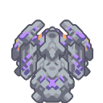
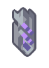
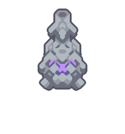

#  Toxopid

*"Fires large electric cluster-shells and piercing lasers at enemy targets. Can step over most terrain."*

| Property | Value |
|---|---|
| Health | 22000 |
| Armor | 22 |
| Size | 3.25x3.25  blocks |
| Build Cost |  1.0null Silicon  600 Plastanium  500 Surge Alloy  350 Phase Fabric |
| Flying | No |
| Speed | 3.75  tiles/second |
| Can Boost | No |
| Item Capacity | 100 |
| Weapons | 
 • Firing Rate: 2x 2 /sec
 • 110 damage
 • pierce

 • Firing Rate: 0.28 /sec
 • 50 damage
 • 75 area dmg ~ 10.0 tiles
 • 0.8 knockback
 • 5x lightning ~ 50 damage
 • Sapped ~ 10 seconds
 • 9x frag bullets:
 • 40 area dmg ~ 8.7 tiles
 • 0.8 knockback
 • 2x lightning ~ 30 damage
 • Sapped ~ 10 seconds |
| Range | 29.5 |
| Leg Splash Damage | • 80 area dmg ~ 7.5 tiles per leg |
| Targets Air | Yes |
| Targets Ground | Yes |
| Internal Name | `toxopid` |

##### Created in

