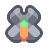
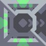

#  Mono

*"Automatically mines copper and lead, depositing it into the core."*

| Property | Value |
|---|---|
| Health | 100 |
| Armor | 0 |
| Size | 0.75x0.75  blocks |
| Build Cost |  30 Silicon  15 Lead |
| Flying | Yes |
| Speed | 11.25  tiles/second |
| Mine Speed | 250 % |
| Mine Tier | Copper Copper  Lead Lead  Scrap Scrap |
| Item Capacity | 20 |
| Range | 6.2 |
| Targets Air | Yes |
| Targets Ground | Yes |
| Internal Name | `mono` |

##### Created in

