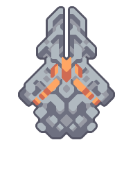

#  Omura

*"Fires a long-range piercing railgun bolt at enemy targets."*

| Property | Value |
|---|---|
| Health | 22000 |
| Armor | 16 |
| Size | 7.25x7.25  blocks |
| Build Cost |  1.0null Silicon  600 Plastanium  500 Surge Alloy  350 Phase Fabric |
| Flying | No |
| Speed | 4.65  tiles/second |
| Can Boost | No |
| Immunities |  Wet |
| Item Capacity | 230 |
| Weapons | 
 • Firing Rate: 0.54 /sec
 • 1,250 damage
 • pierce |
| Range | 62 |
| Targets Air | Yes |
| Targets Ground | Yes |
| Internal Name | `omura` |

##### Created in

