# Spriting

Spriting is an essential part of Mindustry modding; anything you have made will appear as poorly scaled "oh no" images without it.

The spriting style in Mindustry is simple yet very restrictive; what you can get away with in other games looks out of place in Mindustry.

You can find all the vanilla sprites [here](https://github.com/Anuken/Mindustry/tree/master/core/assets-raw/sprites).

**Please note that using other modders' sprites without their permission is not allowed, although you may use them for inspiration or reference.**

**Reasoning such as "The mod is open-source, I can do whatever I want with it," or something similar will not be acknowledged or tolerated and your mod will be blacklisted from the mod browser.**

## **Spriting Software**

It is highly recommended that you use spriting software that supports transparency and exporting images in `.PNG` format. Below is a list of recommended software.

### **Desktop**

- **Aseprite**

The gold standard. Has a bit of a learning curve, but it is very simple once you get used to it.

- It is **paid** software, but you can **compile the source code on your own**. Please buy a license to support its developers.

- Has many features useful for Mindustry spriting such as:
Mirroring

- Palette Control

- Animation

- Layering (Can also export individual layers)

- **LibreSprite**

A fork of the Aseprite repository, not as up-to-date or as powerful as Aseprite, but it should work for spriting in Mindustry style.

- **Piskel**

A straightforward pixel art software that is not as powerful as Aseprite or LibreSprite, but it is sufficient. There is an online version & an offline downloadable version, both with the same features.

- Cannot export individual layers

- **Pixilart**

An online spriting tool that has more features than Piskel though it lacks a mirror tool. If you're more familiar with pixilart, use this over piskel.

- Pretty bloated for spriting in Mindustry style.

- **Paint.NET**

Very basic painting software (not to be confused with Paint 3D). Paint.NET is usable but not as convenient as the software mentioned above.

- Paint.NET lacks basic features needed for spriting in mindustry style. You can get some of these missing features with plugins.

- That said, it is not recommended to use this for the sake of convenience. If you can download Paint.NET, you can probably download Piskel or LibreSprite instead, which are meant for pixel art.

### **Mobile**

- **Novix Pixel Editor**

Old and reliable, made (and since abandoned) by Anuke. It's simple, has no ads, and despite its age is still a solid spriting tool for mobile users; it also supports the mirror tool.

- Occasionally breaks if spriting a larger sprite.

- **Pixel Studio**

One of the most popular pixel art apps.

- Has most of the features you need and it can also link with its PC version.

- Has ads

- **Ibispaint X**

Not meant for spriting, and requires some setting changes before use.

- Supports various tools like octal mirrors, bloom, and gradients, as well as fundamental features like region select and layers.

- Can be used to sprite complex sprites with ease, but could be bloated for simple sprites.

- Also has ads

## **Size**

### Blocks

The smallest block sprite you can make is `32px × 32px`, which is a 1×1 block. Making bigger blocks means increasing the sprite size by an additional `32px`, so a 2×2 block is `64 × 64`, and so on. This applies to both turrets and blocks.

- `1×1` : `32px × 32px`

- `2×2` : `64px × 64px`

- `3×3` : `96px × 96px`

- `4×4` : `128px × 128px`

- `5×5` : `160px × 160px`

You are not limited to these sizes; the game will still load sprites bigger or smaller than the recommended sprite, which can result in a unique-looking sprite, or an atrocity.

### Items, Liquid, Statuses

For these content types, the minimum sprite size is `32px`; you can use larger images, but the game will squish them down to `32px`. The game will not enlarge smaller images, so `32px` is the minimum.

### Units

Unit sprite sizes are more lenient than others, though try not to go below `48px`. The bigger your units are, the more you will have to adjust their `hitSize` (hitbox size).

## **Storing Sprites**

Sprites can be dropped in the `sprites/` subdirectory of your mod if it is HJSON, or `src/assets/sprites/` if it is a Java mod. The content parser will look through it recursively.

Images are packed into an "atlas" for efficient rendering. The first directory in `sprites/`, e.g., `sprites/blocks`, determines the page in this atlas that sprites are put in. Putting a block's sprite in the units folder is likely to cause lots of lag; thus, you should try to organize things similarly to how the vanilla game does.

The game will look for sprites for content based on its name. `content/blocks/test-turret.json` has the name `test-turret`, and similarly, `sprites/test-turret.png` has the name `test-turret`, so it will be used by this content.
- Blocks should be stored in `sprites/blocks`
- Units should be stored in `sprites/units`
- Items should be stored in `sprites/items`

The game will modify some sprites. Turrets and units will have a `3-4px` gray border added to them, so you must account for that while making your sprites, leaving space around turrets. Default outline radius and color can be customized by changing the `outlineRadius` / `outlineColor` fields in the `Block` and `UnitType` classes.

### Overriding

Overriding existing sprites is possible; for this, sprites must be placed at `sprites-override/`.

## **Suffixes**

The game also can look for multiple sprites for a single block.

For turrets, the game could look for the suffix `-heat` (`test-turret-heat.png`).

For blocks and crafters/smelters, the game may look for `-top` and `-liquid`, which will be documented in their section.

You can read the source code for each respective block class for what sprites they can load for more details. See the lines with `@Load`.
For sprites in mods, check each `load()` method within the block class, if there is one.

## **Color Palette**

Just like every game out there, Mindustry has its color palette. For beginners, it is highly recommended to stick to these specific colors for your sprites, or it may look out of place at best and even become heretical at worst. It may inflict great disturbance upon the #spriting Discord channel.

Block Color Palette:

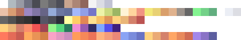

Environment Color Palette

Assuming you have correctly acquired proper spriting software, you should be able to download these images and use them as a color palette.

## **Styles and Shading**

Mindustry has a simple yet restrictive art style. What may work for other games will look out of place in Mindustry. Because of this, guidelines have been established to help modders to create sprites that will fit in the game.

Mindustry is a 2D game, so to add depth such as elevation and depression, we need to do a trick called 'shading'. Despite the actual asset being a 2D image, this trick makes it look 3D in-game.

Depending on where the light is shined, **elevations** are marked with **lighter tone**, **flat areas** with the **midtone**, and **depressions** with the **darker tone**. Picturing something in its 3D form and then drawing it in 2D is usually a good way to sprite something in Mindustry.

This is only a guideline, however if you bend it without having made successful Mindustry sprites first, you will most likely create an abomination, and the #spriting channel will not be happy.

### **Block Shading**

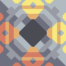

We will use the Surge Smelter as an example.

With blocks, the light source is near the **top right** corner, and the shadows are in the **bottom left**. Pixels in the top right, which are close to the light source, should be light colored. Likewise, pixels in the bottom left should be dark. It works best to have a diagonal line through the middle separating them.

Most blocks have 3 color types:

- Base color, which has 3 shades:

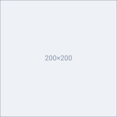 `B0BAC0` | Light Tone

-  `989AA4` | Midtone

-  `6E7080` | Dark Tone

- Decal color, which also has 3 shades:

 `FEB380` | Light Tone

-  `EA8878` | Midtone

-  `BC5452` | Dark Tone

- Bottom color

 `4a4b53`

**Base Color** represents the primary color of the block. It is recommended to only use shades of gray for crafters, as all vanilla crafters do.

**Decal Color** is the accent color on your block. It represents the block's **role** or **purpose** and a way to differentiate them from each other. To pick what decal color to use for your blocks, you should think about your block's purpose. For example:

**Plastanium Compressor**

Plastanium Compressor has a green decal. This green decal is the same color as plastanium. Therefore, just by looking at it you can tell this block has a connection with plastanium.

**Bottom Color** represents the insides of the block, where no light reaches, so it should be very dark. This could represent the bottom of a block with a chimney, like the Surge Smelter, for example.

Please note that different blocks require different amounts of layers depending on their type; for example, a wall would need only 1 layer, which is the sprite itself, while blocks like a reconstructor would need up to 4. See [#suffixes](#suffixes).

Modded Examples:

- Unit Bunker by Flin#8261 from [DiverseTech](https://github.com/FlinTyX/DiverseTech)

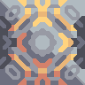

- Surge Mixer by Geschiedenis #4783 from [Unlimited Armament Works](https://github.com/Eschatologue/Unlimited-Armament-Works)

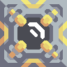

### **Turret Shading**

With turret shading, the light source is on the **right side**, and the shadows are on the **left**.

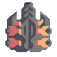

We will use the '**Ripple**' as an example for this part.

Turrets in general have 2 to 3 color types, with 2 tones for each:

- Base color

-  `7B7B7B` | Light Tone

-  `4D4E58` | Dark Tone

- Decal color

-  `FEB380` | Light Tone

-  `EA8878` | Dark Tone

- [Optional] Barrel Hole Color

-  `2C2D38`

**Base Color**, or Body-Color, is the primary color of the turret. This can be classic copper brown, white, dark grey, or a custom color (from the palette!).

- Copper Brown

  

- Usually represents a low tier turret, such as **Duo**, **Scorch**, **Hail**, etc.

-  `C9A58F`

-  `8F665B`

- White

 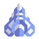 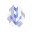 

- Usually represents turret that uses power instead of items to shoot, such as **Arc**, **Lancer**, **Parallax**, **Segment**.

-  `F4F4F4`

-  `C1C3D4`

- Dark Gray

 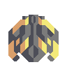 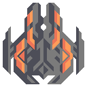

- In most cases, dark grey represents mid to high tier turret.

-  `7B7B7B`

-  `4D4E58`

**Decal color** in the turret is the same as regular block; it is an accent color and can represent the turret's role, purpose, or archetype. For example, if you are trying to group your turrets into different classes, you can differentiate them by decal color.

**Barrel Hole** is an optional color for turrets that represents the barrel hole of your turret; this is usually used for artillery turrets or missile launchers.

-  `2C2D38`

#### Unconventional Methods

- **Turret Midtone**

Still a relatively new unconventional method is adding midtones into turret sprites to make it seem to have a flat surface, instead of only light and dark tones.

- One example of this is the "Skyhammer" from [Unlimited Armament Works](https://github.com/Eschatologue/Unlimited-Armament-Works)

- 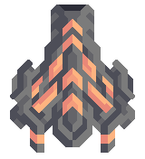

### **Resources Shading**

Resource shading is quite simple and can have its light coming from **top corners**, **top to down**, or **right to left**.

Resource sprites should only use 2 or 3 shades of one color. Make sure the sprite looks 3d and not flat, as then it will stick out like a paper thumb.

Examples:

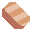

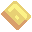

### **Unit Shading**

Units are generally the hardest to shade.

Unit shading can get pretty complex for bigger units. In unit shading, light comes from the **top to bottom** or **front to back**. The intensity of lighter tone and darker tone changes depending on what part you are working with on the unit.

For units, light tone represents **elevation**, midtone represents **flat area**, and dark tone represents **depression**.

#### **Unit Base Color**

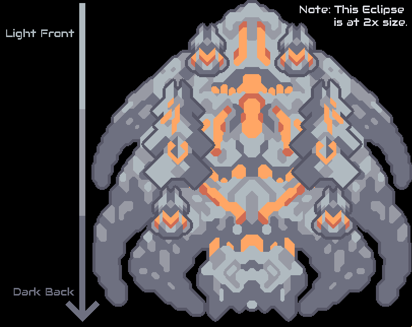

The Eclipse is used for this example as it is the most complicated vanilla unit. As you continuously work towards the backside, there will be less light tone and more midtone and dark tone.

Parts that get lit by the light will have a lighter tone, while the ones that are not get a darker tone; flat areas are midtone.

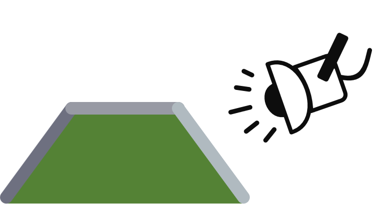

Above is a rough illustration of units if imagined in 3D.

- Base color, has 3 tones as usual:

-  `B0BAC0` | Light Tone

-  `989AA4` | Midtone

-  `6E7080` | Dark Tone

#### **Unit Decal Color**

Unit decal color only has 2 tones: light and dark. The color represents the unit's role in-game.

- Yellow Color represents **Core** units, which the Core produces.

-  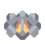

 `FFD37F` | Light Tone

-  `D4816B` | Dark Tone

- Orange Color represents **Assault** units, which have the role of attacking your opponents.

- 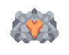 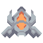

 `FFA665` | Light Tone

-  `D06B53` | Dark Tone

- Green Color represents **Support** units that can build, heal, and shield your units.

- 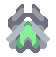 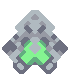

 `84F491` | Light Tone

-  `62AE7F` | Dark Tone

- Purple Color represents ~~spooder~~ **Specialist** units, which do other things.

- 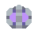 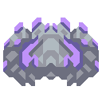

 `BF92F9` | Light Tone

-  `665C9F` | Dark Tone

You are free to pick whatever color you would like, as long as it's present on multiple units and fits with the other colors in the palette.

#### **Unit Cell/Team Color**

Unit Cells are sprites used to differentiate units between teams; they are separate sprites that will be loaded on top of the unit.

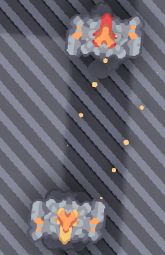

 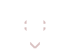

Above is a fortress with its cell. The game will automatically replace the **white** (#FFFFFF) and **tan** (#DCC6C6) colors with shades of team color. Your cell sprites should only have the two shades below:

-  `FFFFFF` | Light Tone

-  `DCC6C6` | Dark Tone

Spriting software capable of using layers and exporting them separately is highly recommended because you can sprite the unit itself and the cell on a separate layer within one file.

#### **Unit Weapons**

Unit Weapons follow the same rules as turrets and unit shading; they can be shaded from **top to bottom** or **right to left**.

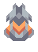
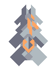

Weapons' rotation is based on the centre of the sprite; if you want to shift the weapon rotation point, you must shift the sprite.

#### **Unit Spriting Stages**

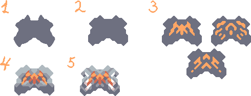

The process of drawing units can be roughly divided into 5 stages:

- Scribble down the general shape. Pick a thick brush with a dark tone and paint it, slowly adding lines over each other and forming basic shapes without much precision. Try to make them slightly deformed or curved, and make sure the shape looks nice - you cannot make a good sprite out of a bad shape in most cases, so make sure you are satisfied before you move on.

- Refine the shape and make it out of lines angled at 45 degrees. You may want to tweak edges, and don't try to follow the doodle you already made too closely.

- Add decals. This is tricky because decals are hard to get right. I showed 3 examples that work - you should experiment for yourself, however, and see what works best for you. The reason why it's better to add them now is that later you will be able to "build shades" around decals, making it easier to proceed at stage 5.

- Roughly mark the lighter and darker parts. Since the light comes from the top, you can and should help yourself and mark what shapes you want to be illuminated the least or the most right away to spare yourself from overthinking about it. Refrain from covering too much space because around 30-40% of the sprite should be the dark shade. Also, note that you should leave the area around decals dark to increase the contrast and make it more appealing to look at.

- By far the most complex part - "add details". There are not many tricks you can use; you have to get good at this. However, there is one I use: when uncertain about what should you add, add cells there. They can work like extra decals, and you may want to build your shapes around them. Refrain from adding too many details, and use any convenient corner or slab to carve a new shape.

written by Zhenьkotron#9493, proofread by Geschiedenis#4783, grammar fixed by BalaM314#4781.

### **Outlines**

Leave 4 pixels of space around the edges of turret sprites and unit sprites, as the game will use that space to automatically add outlines.

### **Environmental Sprites**

Environmental sprites are a bit different from the rest of the Mindustry spriting style, which is that the **45° increment rule doesn't apply**.

Environmental sprites will make up most, if not the majority, of a Mindustry game, so it should be in your best interest that the sprite you've made is subtle enough and looks great despite being tiled over and over again.

#### **Floors**

Floors only have 2 color tones, and the number of variations is up to you.

- Vanilla Examples :

  

-   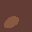

- Modded Examples :

  

- 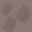  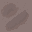  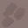 

Sprites by Sh1penfire#0868 from [Endless-Rusting](https://github.com/Sh1penfire/Endless-Rusting)

#### **Static Walls**

Not to be confused with buildable defenses, environmental walls have **3 color tones**, and just like floors, the number of variations is up to you.

Walls also have an optional 2x2 version, which is randomly mixed in with the 1x1 walls.

- Vanilla Example :
  

- Modded Example :
 

Sprites by Sh1penfire#0868 from [Endless-Rusting](https://github.com/Sh1penfire/Endless-Rusting)

#### **Ores**

Ores are overlaid on top of floors, so they should look decent across all floor textures they will likely be placed on.

- Vanilla Examples :
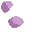  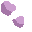

- 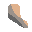 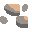 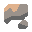

- Modded Examples :
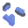 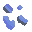

- 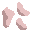 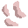 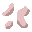

Sprites by Sh1penfire from [Endless-Rusting](https://github.com/Sh1penfire/Endless-Rusting)

#### **Props**

Props (or boulders) are player-breakable environmental blocks that occur randomly over a floor; they have their own files, separate from environmental sprites.

- Examples :

 

-  

#### **Trees**

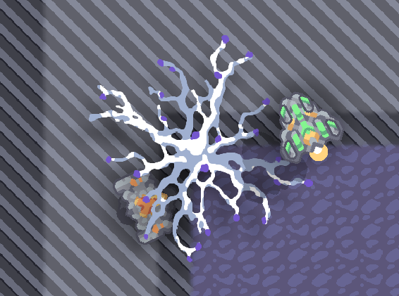

Trees are drawn above most types of blocks; units can also pass through them, and they only act as additional foliage for maps.

Keep in mind that trees in particular have shadow sprites, you have to make these manually.

- Examples :

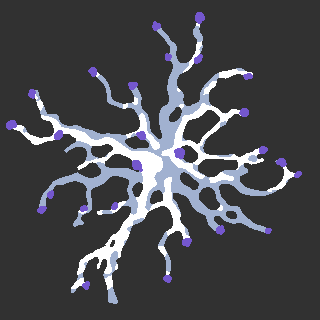

- 
