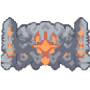
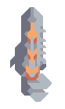

# 王座

*"向敌方目标连射一串巨型穿甲子弹。"*

| 属性 | 值 |
|---|---|
| 生命值 | 24000 |
| 护甲 | 30 |
| 尺寸 | 3.75x3.75  格 |
| 建造成本 |  1.0null 硅  600 塑钢  500 巨浪合金  350 相织布 |
| 飞行 | 否 |
| 速度 | 3  格/秒 |
| 可加速 | 否 |
| 物品容量 | 120 |
| 武器 | 
 • 射速: 2x 3.33 /秒
 • 80 伤害
 • 18 范围伤害 ~ 1.6 格
 • 10x 穿透
 • 3x 碎片弹药:
 • 20 伤害
 • 15 范围伤害 ~ 1.2 格
 • 3x 穿透 |
| 射程 | 23.8 |
| 对空 | 是 |
| 对地 | 是 |
| 内部名称 | `reign` |

##### 制造于

