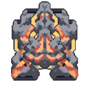

# 领主

*"向敌方目标连射大量穿甲子弹。受液体阻力影响显著较小。"*

| 属性 | 值 |
|---|---|
| 生命值 | 22000 |
| 护甲 | 26 |
| 尺寸 | 5.75x5.75  格 |
| 建造成本 |  480 钍  540 硅  240 铍  180 钨  480 碳化物 |
| 飞行 | 否 |
| 速度 | 3.6  格/秒 |
| 可加速 | 否 |
| 免疫 |  燃烧  熔化 |
| 物品容量 | 180 |
| 武器 | 
 • 射速: 0.6 /秒
 • 270 伤害
 • 3x 穿透
 • 12x 生成弹药:
 • 60 伤害
 • 65 范围伤害 ~ 3.7 格
 • 2x 穿透 |
| 射程 | 34.5 |
| 碾压伤害 | 1500 /秒 |
| 对空 | 是 |
| 对地 | 是 |
| 内部名称 | `conquer` |

##### 制造于

