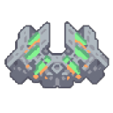

# 死星

*"发射强力激光爆破，伤害敌方目标并修复友方建筑。可跨过大部分地形。"*

| 属性 | 值 |
|---|---|
| 生命值 | 18000 |
| 护甲 | 14 |
| 尺寸 | 3.625x3.625  格 |
| 建造成本 |  1.0null 硅  600 塑钢  500 巨浪合金  350 相织布 |
| 飞行 | 否 |
| 速度 | 2.25  格/秒 |
| 可加速 | 否 |
| 物品容量 | 110 |
| 武器 | 
 • 射速: 0.17 /秒
 • 560 伤害
 • 25% 修复
 • 穿透
 • 28倍闪电 ~ 50 伤害
 • 4.37 格间隔 ~ 5-20 格长度 |
| 射程 | 57 |
| 对空 | 是 |
| 对地 | 是 |
| 内部名称 | `corvus` |

##### 制造于

