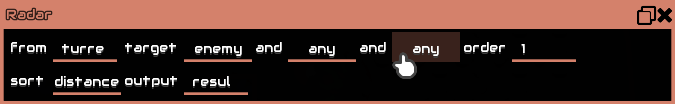

# 术语表

本术语表对本手册中使用的许多术语提供了更详细的解释。

## 数据类型

Mindustry 中有两种主要数据类型：number 与 Object。

### number

一个小数。可以为负或正，并能表示真（任何不等于 0 的值）或假（0）。Null 也表示为 0。

某些指令只接受整数，因此本手册中会相应标明。

在内部，数字以 64 位浮点值（`double`）存储，而在涉及位移运算时，则按 64 位有符号整数（`long`）运算。

### String

一个表示引号内文本的 Object，例如 `"hello mindustry"`。

### Building

一个表示世界中实体建筑的 Object。

**这与 Block 不同；Block 只是 Building 的一种类型，而 Building 是实体的方块——也就是说，它有生命值、会与电力和物品交互等。

本质上，**建筑是世界中实际存在的方块。**

例如，`getlink` 指令会返回一个 *Building* 对象，你可以用 `sensor` 获取它的信息。

### Unit

一个表示世界中某个单位（包括玩家）的 Object。

例如，`ubind` 指令会把处理器变量 `@unit` 设置为一个表示已绑定单位的 Unit 对象。

## 参数类型

这些类似数据类型，但只能作为指令的参数使用，且不会被任何指令返回。

### BuildingType `content`

一种 Building 类型。以 `@` 开头。

在游戏代码中，这更适合称为 “Block”。不过，为便于本手册阅读，我们称它为 BuildingType。*关于 Building 与 Block 的区别，见 [###Building]。*

与 Item 和 Liquid 不同，你不能在 `sensor` 中使用它。不过，你可以在 `sensor` 中使用 `@type`，并用 `jump` 与之比较。

示例： `@scatter`

### UnitType `content`

一种 Unit 类型。以 `@` 开头。

示例： `@toxopid`

*完整列表显示在“Unit Bind”指令块的铅笔按钮下。*

### Senseable

一种可被 `sensor` “感知”的 Item、Liquid、Building 或 Unit 属性。以 `@` 开头。

示例： `@scrap`, `@slag`, `@totalAmmo`

*完整列表显示在“Sensor”指令块的铅笔按钮下。*

### Target

用于筛选单位或方块目标的特征。主要用于 `radar`、`uradar` 和 `ulocate`。`radar` 与 `uradar` 的 Targets 相同，但 `ulocate` 不同，因为它查找的是建筑。

*完整列表可通过在 `radar` 与 `uradar` 中点击 “target” 后的参数，或在 `uradar` 中点击 “find” 与 “type” 后显示。*

### Op

一种数学运算。*这与 `op` 指令不同。*

*完整列表显示在“Operation”指令块的“+”按钮下。*

对于更复杂的部分，你可以搜索“Java math”。

### Comp

一种比较。主要用于 `jump` 指令中比较两个值。`always` 无论如何都返回真，因此总会触发跳转。

*完整列表显示在“Jump”指令块的比较按钮下。*

