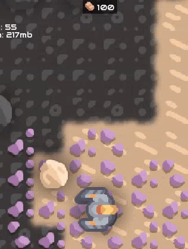

# 脚本

Mindustry 使用 JavaScript 进行模组脚本编写。脚本使用 `js` 扩展名，放在 `scripts/` 子目录中。

执行从名为 `main.js` 的文件开始。主文件可通过 `require("script_name")` 导入其他脚本文件。
典型的结构如下：

*scripts/main.js*：

```
require("blocks");
require("items");
```

*scripts/blocks.js*：

```
const myBlock = extend(Conveyor, "terrible-conveyor", {
  // 各种覆写...
  size: 3,
  health: 200
  //...
});
```

*scripts/items.js*：

```
const terribleium = Item("terribleium");
terribleium.color = Color.valueOf("ff0000");
//...
```

# 示例

## 监听事件



```
// 监听单位被摧毁的事件
Events.on(UnitDestroyEvent, event => {
  // 当该单位是玩家时，在屏幕顶部显示提示
  if(event.unit.isPlayer()){
    Vars.ui.hudfrag.showToast("Pathetic.");
  }
})
```

要找到可以监听的事件，最简单的方法是查看源文件：[Mindustry/blob/master/core/src/mindustry/game/EventType.java](https://github.com/Anuken/Mindustry/blob/master/core/src/mindustry/game/EventType.java)

## 显示对话框

```
const myDialog = new BaseDialog("Dialog Title");
// 添加「返回」按钮
myDialog.addCloseButton();
// 向主内容区添加文本
myDialog.cont.add("Goodbye.");
// 显示对话框
myDialog.show();
```

## 播放自定义音效

只要把音频片段以 `.mp3` 或 `.ogg` 文件的形式存放在 `/sounds` 目录中，播放自定义音频就很简单。

在本例中，我们把 `example.mp3` 存放在 `/sounds/example.mp3`。

### 使用库加载音效

*scripts/alib.js*：

```
exports.loadSound = (() => {
    const cache = {};
    return (path) => {
        const c = cache[path];
        if (c === undefined) {
            return cache[path] = loadSound(path);
        }
        return c;
    }
})();
```

*scripts/main.js*：

```
const lib = require("alib");

Events.on(WaveEvent, event => {
    // 加载 example.mp3
    const mySound = lib.loadSound("example");
    // 引擎会在此位置 (X,Y) 播放该音效
    mySound.at(1, 1);
})
```
