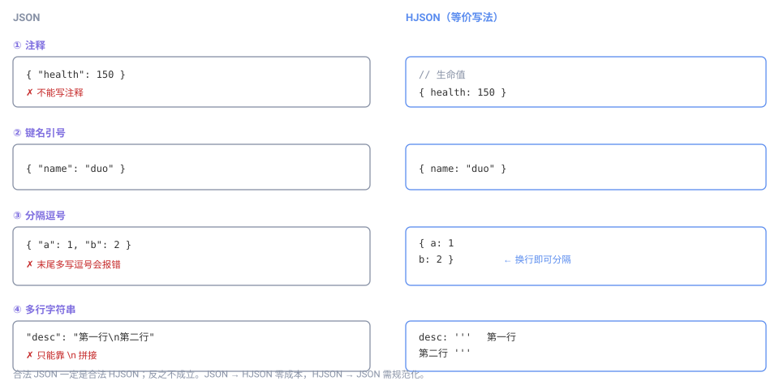
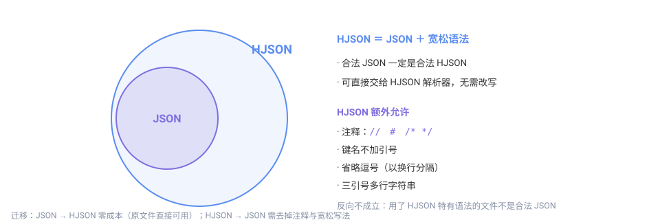

# HJSON

**HJSON**（Human JSON，人类友好的 JSON）是 [JSON](json.md) 的一个**超集**。它在完全兼容 JSON 的前提下，放宽了书写要求并加入注释支持，让配置文件更易读、易写、易维护。

Mindustry 的数据补丁支持以 HJSON 编写（文件扩展名 `.hjson`）。

## 设计目标

JSON 的严格语法适合机器生成，但由人手书写时体验不佳——不能写注释、键名必须加引号、不能有尾随逗号，稍不注意就报错。

HJSON 针对这一点做了取舍：**解析器更宽容，书写者更轻松**，代价是格式本身不再唯一（同一份数据可以有多种写法）。



## 与 JSON 的关系

这是理解 HJSON 的关键：



- **合法 JSON 一定是合法 HJSON**——可以直接交给 HJSON 解析器
- HJSON 额外允许若干宽松写法（下面详述）
- 用了 HJSON 特有语法的文件，**不是**合法 JSON，不能被严格的 JSON 解析器读取

因此从 JSON 迁移到 HJSON 是**零成本**的：原文件不改也能解析，想加注释时再加即可。

## 相对 JSON 放宽的方面

### 1. 支持注释

这是 HJSON 最实用的特性。支持三种注释：

```hjson
{
  // 单行注释（斜杠）
  # 单行注释（井号）
  "health": 150
  /* 多行注释
     可以跨行 */
  "speed": 1.1
}
```

JSON 中写注释会直接报错，HJSON 中则会被解析器忽略。

### 2. 键名可不加引号

只要键名不含特殊字符，引号可以省略：

```hjson
{
  name: "duo"
  health: 260
}
```

等价于 JSON 的 `{ "name": "duo", "health": 260 }`。

### 3. 可省略逗号

元素之间可以用**换行**分隔，逗号变为可选：

```hjson
{
  name: "duo"
  health: 260
  size: 1
}
```

逗号仍然可以写（写了也合法），但在换行分隔时不必写。

### 4. 支持多行字符串

用三引号 `'''` 包裹的字符串可以跨行，内部的换行会原样保留：

```hjson
{
  description: '''
    这是可以跨多行书写的描述文本。
    换行与缩进都会保留下来。
  '''
}
```

这在写较长的说明文本时非常方便，JSON 中只能靠 `\n` 拼接。

## 仍然必须遵守的规则

HJSON 虽然宽松，但下面几点与 JSON 一致：

**1. 字符串的引号**

字符串值仍然需要引号包裹（双引号 `"` 或单引号 `'` 均可）：

```hjson
{
  name: "duo"
  category: 'turret'
}
```

**2. 数据类型不变**

可用的类型与 JSON 相同：字符串、数字、布尔、null、对象、数组。

**3. 结构闭合**

花括号、方括号仍须成对闭合，缩进不影响解析结果（只影响可读性）。

## 一个完整示例

下面是一份用 HJSON 书写的方块配置，含注释、无引号键名与省略逗号：

```hjson
{
  // 基础信息
  name: duo
  localizedName: "Duo"
  health: 260
  size: 1

  # 建造成本
  requirements: [
    { item: copper, amount: 35 }
    { item: lead, amount: 20 }
  ]

  // 攻击属性
  range: 160
  reload: 12
  targetAir: true
  targetGround: true
}
```

同一份数据用 JSON 写则为：

```json
{
  "name": "duo",
  "localizedName": "Duo",
  "health": 260,
  "size": 1,
  "requirements": [
    { "item": "copper", "amount": 35 },
    { "item": "lead", "amount": 20 }
  ],
  "range": 160,
  "reload": 12,
  "targetAir": true,
  "targetGround": true
}
```

两者被解析后得到**完全相同**的数据，区别只在书写的宽松程度。

## 使用建议

**什么时候用 HJSON**

- 需要写注释说明某个字段的用途或取值理由
- 配置由人工维护，追求可读性
- 配置较长、需要分段说明

**什么时候仍用 JSON**

- 由程序生成或机器读写（格式唯一、解析更简单）
- 需要被只支持严格 JSON 的工具处理
- 团队约定统一使用标准格式

## 注意事项

**1. 同一份数据有多种写法**

无引号键名、省略逗号等特性意味着格式不唯一。不同人写出的 HJSON 风格可能不同，团队内最好统一风格。

**2. 解析器需支持 HJSON**

严格的 JSON 解析器无法读取含 HJSON 特有语法的文件。使用前请确认目标环境（如 Mindustry 的数据补丁加载器）支持 HJSON。

**3. 转换方向**

HJSON → JSON 总是可行的（去掉宽松写法即可）；JSON → HJSON 更是零成本。具体见[两者对比](compare/)。

## 在 Mindustry 中的典型用法

数据补丁支持 `.hjson` 扩展名。相比等价的 JSON，HJSON 版本可以就地加注释，说明每个字段为何这样改：

```hjson
{
  // 让所有传送带血量翻倍
  block.conveyor.health: 100

  # 给 dagger 换一把更强的武器
  unit.dagger.weapons.0.bullet.damage: 55
}
```

同一份补丁用 JSON 写则必须去掉注释、补上引号与逗号：

```json
{
  "block.conveyor.health": 100,
  "unit.dagger.weapons.0.bullet.damage": 55
}
```

## 书写要点

- 注释只在 `.hjson` 中合法；若文件扩展名是 `.json`，注释会导致解析失败
- 省略逗号时依赖**换行**分隔，因此不能把两个键值对写在同一行
- 键名不加引号的前提是不含空格等特殊字符；含空格时仍需引号
- 缩进只影响可读性，不影响解析结果

## 校验方法

HJSON 没有随 Python 标准库提供校验工具，可用以下方式：

- 项目提供的 HJSON 解析器（各语言均有实现）读取一次，能通过即语法正确
- 在线 HJSON 校验/转换工具（可同时转成标准 JSON 再用 `python3 -m json.tool` 复核）
- 若手头只有标准 JSON 工具，可先确认文件是**纯 JSON 子集**（不含注释与省略写法），再用 JSON 工具校验

## 常见误区

| 误区 | 实际 |
|---|---|
| 「HJSON 里什么都能省」 | 字符串值仍需引号，结构仍需成对闭合 |
| 「把 .json 改成 .hjson 就行」 | 解析器需支持 HJSON；只认 JSON 的工具会失败 |
| 「缩进决定层级」 | 层级由 `{}` `[]` 决定，缩进只为可读 |
| 「注释可以写在字符串里」 | 引号内的 `//` 是普通字符，不会被当注释 |
