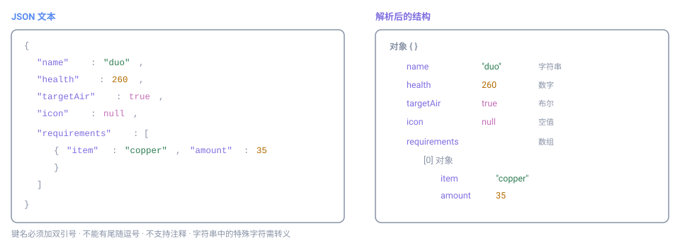

# JSON

**JSON**（JavaScript Object Notation）是一种轻量级的文本数据格式，用于表示结构化的数据。它语言无关、易于人读也易于机器解析，是配置文件中使用最广泛的格式之一。

Mindustry 的模组内容与数据补丁都以 JSON 为基准格式。

## 结构总览

JSON 的顶层是一个**值**，实践中通常是一个对象。对象由若干「键值对」组成，值又可以是对象或数组，如此层层嵌套，构成一棵树。



## 两种容器

JSON 只有两种容器结构，其余都是「值」。

### 对象（Object）

用花括号 `{}` 包裹，内部是若干「键: 值」对，键与值之间用冒号分隔，对与对之间用逗号分隔：

```json
{
  "name": "dagger",
  "health": 150,
  "speed": 1.1
}
```

### 数组（Array）

用方括号 `[]` 包裹，内部是按顺序排列的值，值之间用逗号分隔：

```json
["copper", "lead", "graphite"]
```

数组可以嵌套数组或对象：

```json
{
  "requirements": [
    { "item": "copper", "amount": 10 },
    { "item": "lead", "amount": 8 }
  ]
}
```

## 数据类型

JSON 的值只有以下六种：

| 类型 | 写法示例 | 说明 |
|---|---|---|
| 字符串 String | `"copper-wall"` | 必须用**双引号**包裹 |
| 数字 Number | `150`、`1.1`、`-3` | 整数与小数不区分，不支持前导零 |
| 布尔 Boolean | `true`、`false` | 只有这两个取值，全小写 |
| 空值 Null | `null` | 表示「无」，全小写 |
| 对象 Object | `{ ... }` | 键值对集合 |
| 数组 Array | `[ ... ]` | 有序值列表 |

## 书写规则

JSON 的语法是**严格**的，以下规则没有例外：

**1. 键名必须用双引号包裹**

```json
{ "name": "dagger" }
```

下面这种（JavaScript 风格的无引号键名）**不是**合法 JSON：

```text
{ name: "dagger" }
```

**2. 字符串只能用双引号**

单引号 `'copper'` 不合法。

**3. 不能有尾随逗号**

最后一个元素后面**不能**再加逗号：

```text
{
  "health": 150,
}
```

上面这个末尾的逗号会导致解析失败。正确写法是去掉它：

```json
{
  "health": 150
}
```

**4. 不支持注释**

JSON 规范中**没有注释**。下面这种写法不合法：

```text
{
  // 这是注释，JSON 不支持
  "health": 150
}
```

需要在配置里写注释时，应改用 [HJSON](hjson/)。

**5. 字符串中的特殊字符需转义**

在双引号字符串内部，反斜杠 `\` 用于转义：

| 写法 | 含义 |
|---|---|
| `\"` | 双引号本身 |
| `\\` | 反斜杠 |
| `\n` | 换行 |
| `\t` | 制表符 |
| `\u4e2d` | Unicode 字符（此处为「中」） |

## 一个完整示例

下面是一段描述方块属性的 JSON，涵盖对象、数组、多种数据类型与嵌套：

```json
{
  "name": "duo",
  "localizedName": "Duo",
  "health": 260,
  "size": 1,
  "category": "turret",
  "requirements": [
    { "item": "copper", "amount": 35 },
    { "item": "lead", "amount": 20 }
  ],
  "range": 160,
  "reload": 12,
  "shootSound": "shoot",
  "targetAir": true,
  "targetGround": true,
  "ammoTypes": {
    "copper": {
      "type": "BasicBulletType",
      "damage": 9
    }
  }
}
```

## 常见错误

| 现象 | 原因 |
|---|---|
| 解析报错，提示 unexpected token | 键名没加双引号，或用了单引号 |
| 解析报错，指向末尾 | 多写了尾随逗号 |
| 解析报错，提示非法字符 | 写了注释，或字符串里未转义 |
| 中文显示为乱码 | 文件编码不是 UTF-8 |

排查时可借助任意 JSON 校验工具定位出错行号。

## 与 HJSON 的关系

JSON 是 [HJSON](hjson/) 的**子集**：

- 合法 JSON 一定是合法 HJSON
- 但 HJSON 允许一些 JSON 不允许的写法（注释、无引号键名、省略逗号等）

因此当配置需要注释或更宽松的书写时，可以改用 HJSON；两者可相互转换，具体见[两者对比](compare/)。

## 在 Mindustry 中的典型用法

模组内容文件（如方块、单位定义）通常是一个 JSON 对象，键为字段名，值为该字段的取值：

```json
{
  "type": "GenericCrafter",
  "name": "my-crafter",
  "health": 200,
  "size": 2,
  "craftTime": 60,
  "requirements": [
    { "item": "copper", "amount": 30 }
  ],
  "consumes": { "power": 1.5 },
  "outputItem": { "item": "silicon", "amount": 1 }
}
```

书写要点：

- `type` 决定这个内容由哪个类实现，其余键都是该类的字段
- 数值型字段不要加引号（`"health": 200`，而非 `"health": "200"`）
- 数组元素之间必须有逗号，且最后一个元素后不能有逗号
- 文件编码统一用 UTF-8，否则中文会乱码

## 校验方法

写完 JSON 后，建议先做一次语法校验再交给游戏加载。可用：

- 在线 JSON 校验器（粘贴即校验，会指出出错行）
- 编辑器的 JSON 语法检查（VS Code 等会实时标红）
- 命令行：`python3 -m json.tool 你的文件.json`

其中 `python3 -m json.tool` 在通过时会把内容格式化输出，失败时打印出错位置，适合本地快速排查。
